# HANNA AirCast — 마을 방송 운영 플랫폼

마을 곳곳에 설치된 **IoT 방송 스피커(ESP32-P4/C6)** 를 웹에서 한 번에 관리하고 방송하는 서비스입니다.
이장·면사무소·시군청 담당자가 브라우저에서 **마이크로 바로 말하거나, 글을 적어 음성으로 만들거나, 저장된 음원을 골라**
원하는 마을·구역·단말에 지금 또는 예약으로 내보냅니다.

- **방송 3가지**: 실시간 마이크 방송, 글 → 음성(TTS) 방송, 저장된 음원 방송
- **대상 선택**: 기관 · 마을 · 구역 · 단말 하나하나를 한 트리에서 고르기
- **예약 방송**: 한 번 · 매일 · 매주 · 매월 · 매년 규칙, 7일 예정표
- **현장 관리**: 단말 등록(QR · 수동 · USB 주입), 온라인 상태, 이상 단말, 지도
- **권한**: 최고 · 시도 · 시군 · 마을 4계층, 맡은 범위만 보고 방송

> 백엔드(FastAPI) · 관리자 웹(React) · 인프라(Docker, Mosquitto, Icecast, nginx)를 한 저장소에서 개발·운영합니다.

---

## 목차

1. [화면](#1-화면)
2. [주요 기능](#2-주요-기능)
3. [시스템 구성](#3-시스템-구성)
4. [방송이 단말까지 가는 길](#4-방송이-단말까지-가는-길)
5. [데이터 모델](#5-데이터-모델)
6. [기술 스택](#6-기술-스택)
7. [설계에서 신경 쓴 점](#7-설계에서-신경-쓴-점)
8. [문서 안내 — 무엇을 어디서 읽나](#8-문서-안내--무엇을-어디서-읽나)
9. [저장소 구조](#9-저장소-구조)
10. [로컬 실행](#10-로컬-실행)
11. [구현 현황](#11-구현-현황)

---

## 1. 화면

> 로컬 개발 환경에서 가상 단말 6대로 찍은 화면입니다.

### 방송하기 — 방법 · 대상 · 내용 · 시각을 한 화면에서
번호(①~④) 순서대로 고르면 되도록 만든 핵심 화면입니다. 대상은 마을·구역·단말·모든 마을 탭으로 고르고, 켜진 단말 수가 바로 보입니다.

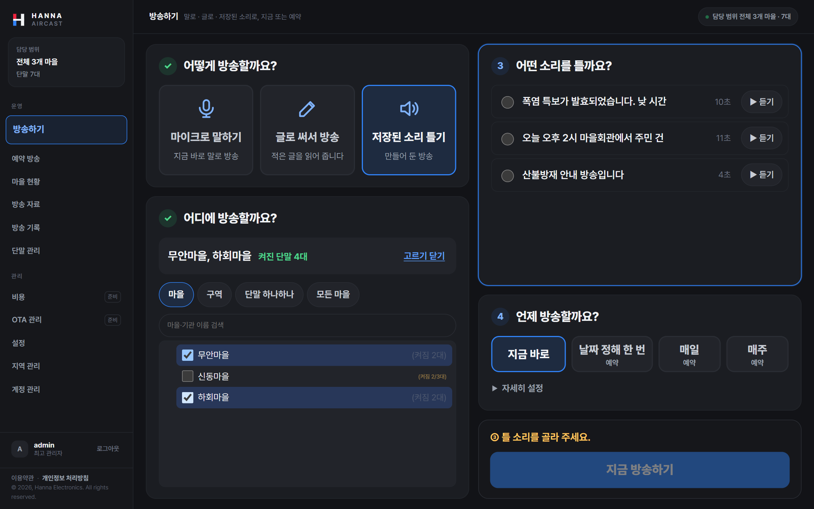

<table>
<tr>
<td width="50%"><b>마을 현황</b> — 온라인·오프라인·방송 중·미배정, 기관 → 시군 → 마을 트리별 상태, 이상 단말<br>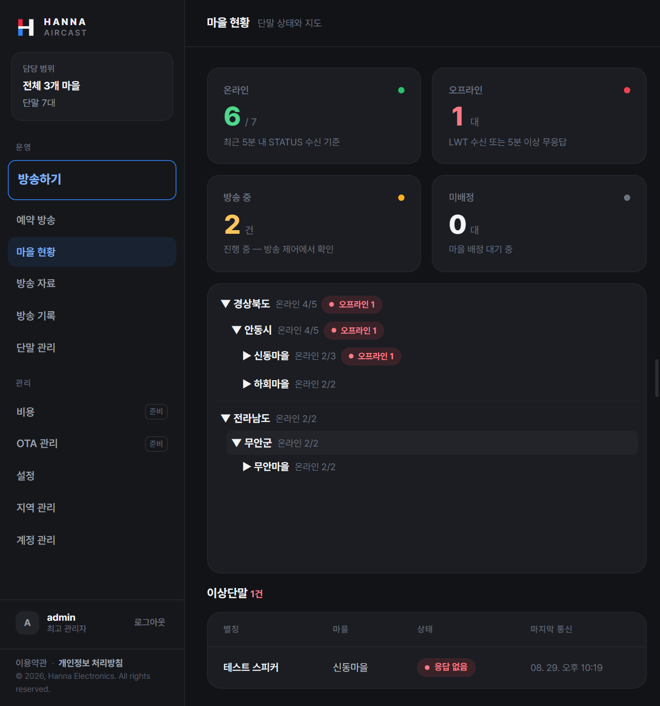</td>
<td width="50%"><b>예약 방송</b> — 반복 규칙 목록, 오늘 일정, 7일 예정표<br>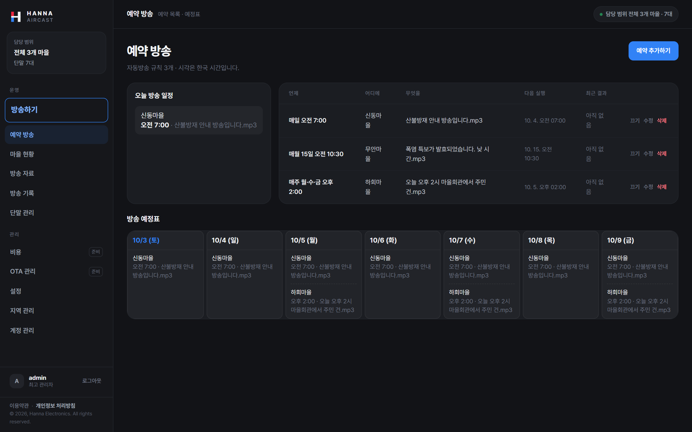</td>
</tr>
<tr>
<td><b>방송 자료</b> — mp3 올리기, 글로 음성 만들기(TTS), 미리듣기<br>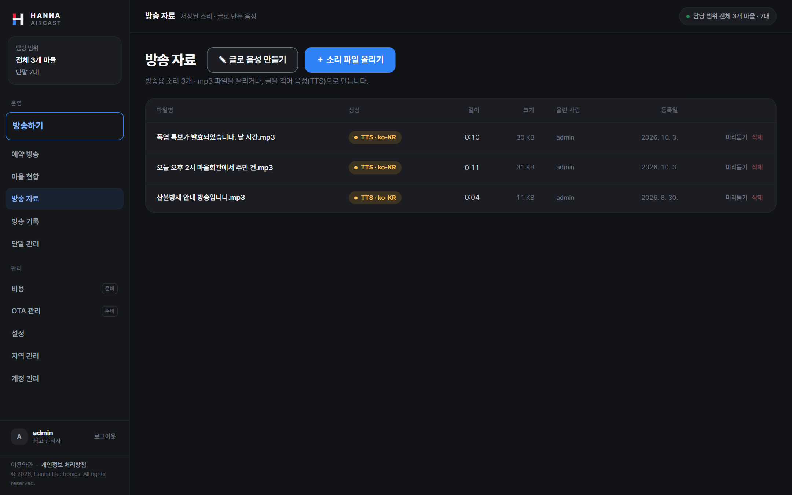</td>
<td><b>단말 관리</b> — 등록·배정·상태, 신호 세기(RSSI), 설정 반영 버전(CFG)<br>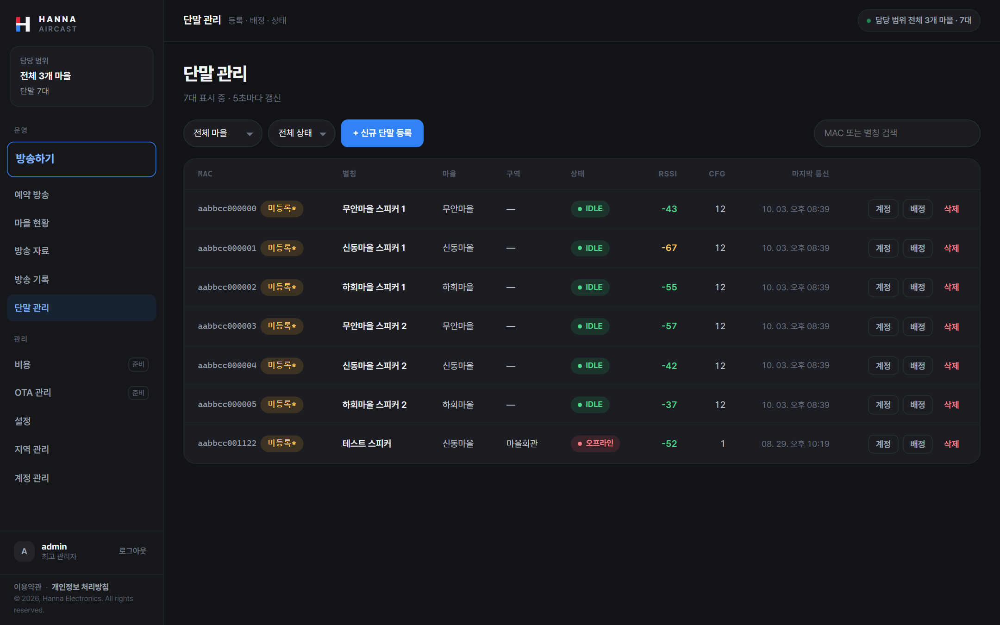</td>
</tr>
<tr>
<td><b>지역 관리</b> — 폴더처럼 다루는 기관 트리, 마을 주소·좌표·구역<br>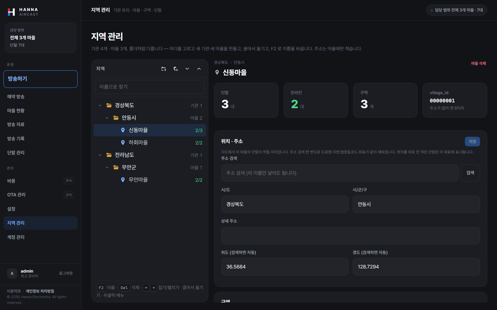</td>
<td><b>설정</b> — 단말 공통 설정, 방송 응답 시간, 오디오 품질<br>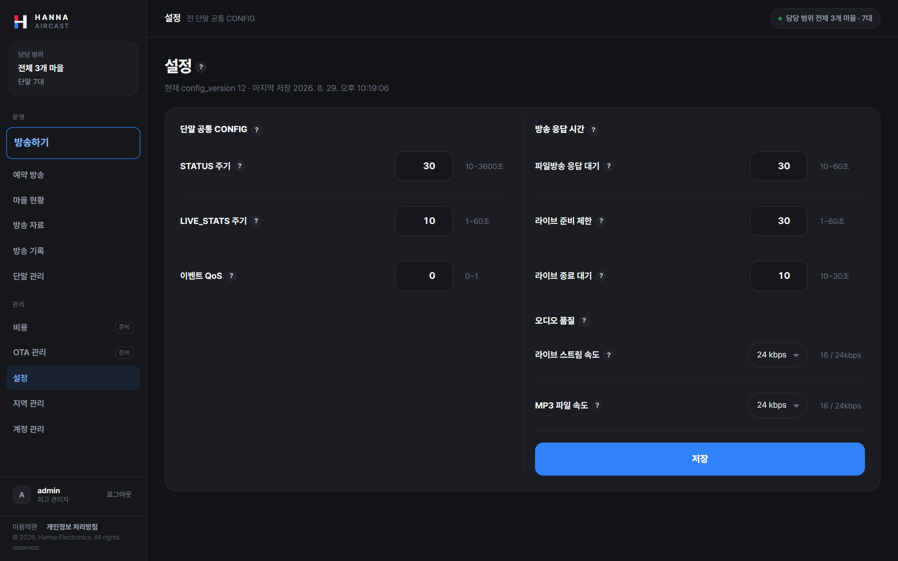</td>
</tr>
</table>

---

## 2. 주요 기능

### 방송
| 기능 | 설명 |
|---|---|
| 실시간 방송 | 브라우저 마이크 → 서버 → 스피커. 방송마다 별도 스트림을 열어 여러 마을이 동시에 방송할 수 있음 |
| 글로 써서 방송 | 적은 글을 Google Cloud TTS 로 음성 합성 → 파일함에 저장 → 미리 듣고 방송. 같은 문구는 다시 합성하지 않음(캐시) |
| 저장된 소리 방송 | mp3 업로드 시 규격 검사·재인코딩, 단말은 짧게 유효한 주소로 내려받고 무결성(sha256) 확인 |
| 대상 선택 | 기관·마을·구역·단말을 한 트리에서. 실제 대상은 방송 시작 순간 온라인인 단말 |
| 겹침 방지 | 같은 단말에 방송이 겹치면 시작을 막고 이유를 알려 줌. 기존 방송을 몰래 끊지 않음 |
| 방송 결과 | 단말별 준비·재생·종료 결과를 모아 진행 중 방송 카드와 기록에 표시 |

### 예약 방송
- 한 번 · 매일 · 매주(요일) · 매월(날짜) · 매년(월·일) 규칙 하나만 저장하고 실행 날짜는 서버가 계산
- 1분마다 도는 실행기, 회차별 실행 결과(시작 · 건너뜀 · 실패와 이유) 기록
- 마을 · 단말 · 기관(실행 시점에 소속 마을로 펼침) 대상

### 단말 · 현장
- **등록**: QR 또는 수동 입력, 브라우저 Web Serial 로 USB 연결된 단말에 접속 정보를 바로 주입
- **보안 접속**: 단말마다 별도 MQTT 계정과 권한(ACL), 전송 구간 TLS(MQTTS)
- **상태**: 주기 보고(STATUS)와 브로커의 연결 끊김 알림(LWT)으로 온라인 판정, 이상 단말 목록
- **설정 배포**: 공통 설정과 단말별 마을 배정을 보관 메시지(retained)로 내리고, 서버 기동 때와 주기적으로 다시 맞춤
- **지도**: 카카오 지도에 단말 위치·마을 경계·클러스터 표시, 주소 검색으로 좌표·법정동코드 자동 입력

### 조직 · 권한
- 최고 관리자 · 시도 · 시군 · 마을(이장) 4계층, 기관 트리는 깊이 제한 없음
- **모든 조회와 제어에서 백엔드가 범위를 강제**(화면 메뉴 숨김에 의존하지 않음)
- 계정 사용 기간과 만료 계정 자동 정리, 임시 비밀번호 발급과 첫 로그인 비밀번호 변경

### 운영
- Docker Compose 한 벌로 배포, 상태 점검·백업·복구 스크립트, AWS 비용 보고
- CI: 린트·단위 시험·마이그레이션 왕복(upgrade → downgrade → upgrade)·프런트 빌드
- 서비스 KPI·SLO 정의(방송 도달률, 시작 지연, 단말 온라인율 등)

---

## 3. 시스템 구성

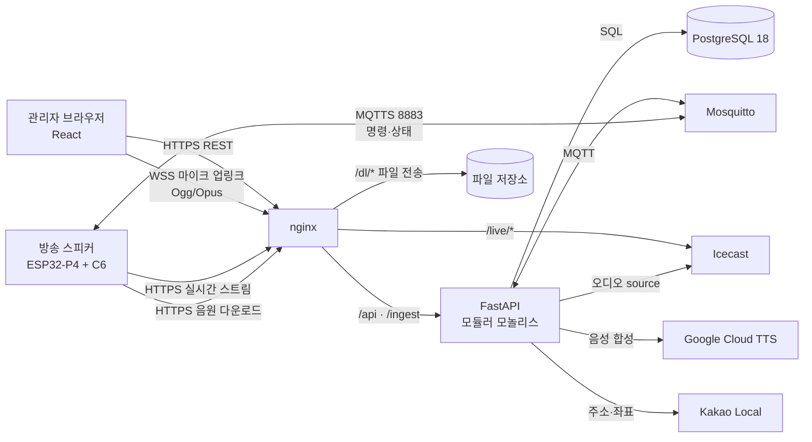

| 구성요소 | 맡은 일 |
|---|---|
| 관리자 웹 (React) | 로그인, 현황·지도, 단말 등록, 방송 제어, 파일·TTS, 예약, 계정·지역 관리 |
| nginx | TLS 종료, 웹 화면 제공, API·WebSocket·스트림 프록시, 파일 전송 |
| FastAPI (단일 프로세스) | REST API, 권한, 방송 수명주기, **MQTT 워커**, **스케줄러**(설정 재조정·예약 실행·계정 정리) |
| Mosquitto | 단말과 명령·설정·상태를 주고받는 MQTT 브로커, 단말별 계정·ACL |
| Icecast | 실시간 방송 오디오를 여러 스피커로 동시 전달 |
| PostgreSQL | 조직·권한·단말·파일·예약·방송 이력·설정 |

---

## 4. 방송이 단말까지 가는 길

### 저장된 소리 / 글로 만든 음성
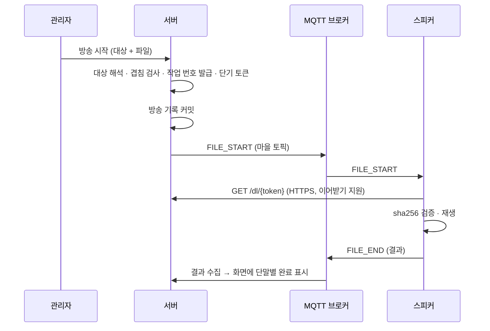

### 실시간 마이크 방송
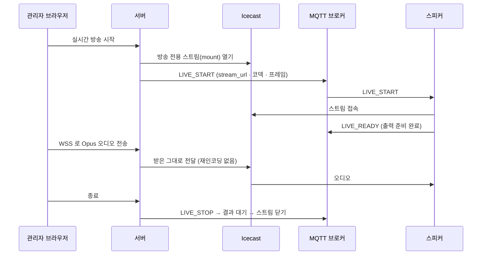

---

## 5. 데이터 모델

PostgreSQL 18, Alembic 마이그레이션 21단계. 테이블별 컬럼·제약·삭제 정책은 [데이터 모델 문서](docs/current/04_데이터_모델.md)에 있습니다.

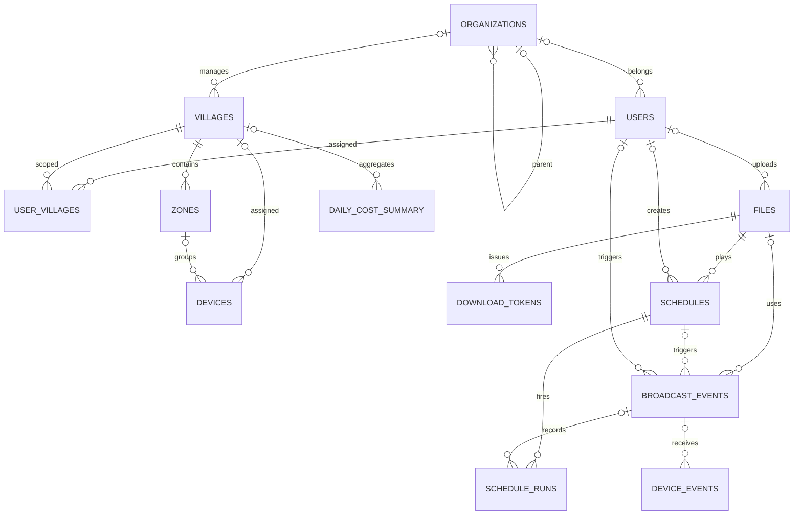

| 영역 | 테이블 | 내용 |
|---|---|---|
| 조직·권한 | `organizations` `villages` `zones` `users` `user_villages` | 깊이 제한 없는 기관 트리, 마을·구역, 계정과 담당 마을 |
| 단말 | `devices` | MAC, 배정, 위치, 하드웨어 정보, 접속 계정, 마지막 상태 |
| 파일 | `files` `download_tokens` | 음원 메타(상대 경로), 단말용 단기 다운로드 토큰 |
| 예약 | `schedules` `schedule_runs` | 반복 규칙 하나, 회차별 실행 결과 |
| 이력 | `broadcast_events` `device_events` | 방송 한 건과 단말별 결과. 단말·계정·파일을 지워도 이력은 남음(스냅샷 저장) |
| 시스템 | `current_config` `daily_cost_summary` | 단말 공통 설정의 정본, 비용 집계 |

---

## 6. 기술 스택

| 영역 | 사용 기술 |
|---|---|
| 백엔드 | Python 3.12 · FastAPI · SQLAlchemy 2 (async) · asyncpg · Alembic · aiomqtt · APScheduler · PyJWT · bcrypt |
| 프런트엔드 | React 18 · TypeScript · Vite · React Router · opus-recorder(WASM Opus 인코더) · Web Serial API · Kakao Maps |
| 데이터 | PostgreSQL 18 (운영은 AWS RDS 기본, 로컬 DB 구성 선택 가능) |
| 메시징·스트리밍 | Mosquitto 2 (MQTT/MQTTS, 단말별 계정·ACL) · Icecast (실시간 오디오) |
| 외부 API | Google Cloud Text-to-Speech · Kakao Local |
| 인프라 | Docker Compose · nginx · Let's Encrypt · AWS (EC2 · RDS) · GitHub Actions |
| 단말 | ESP32-P4 + ESP32-C6, MQTT · Icecast · HTTPS 3채널 |

---

## 7. 설계에서 신경 쓴 점

- **권한은 백엔드가 강제** — 범위 의존성이 "전체 / 이 마을들"을 타입으로 들고 다녀서, 조회는 범위 필터를, 제어는 범위 확인을 반드시 거칩니다.
- **MQTT 발행은 한 곳으로** — payload 크기 상한(1024B), QoS·retain, 권한 재확인을 발행기 하나에 모았습니다.
- **명령은 커밋 뒤에 발행** — 방송 기록·다운로드 토큰을 먼저 커밋해야 단말의 결과와 다운로드 요청이 다른 DB 세션에서 그 기록을 봅니다.
- **동시 방송 시작은 직렬화** — 겹침 검사와 기록 생성 사이를 PostgreSQL advisory lock 으로 묶어, 같은 단말에 방송이 두 번 걸리지 않습니다.
- **실시간 오디오는 손대지 않고 전달** — 브라우저에서 Opus(Ogg)로 인코딩해 서버는 바이트를 그대로 Icecast 로 넘깁니다. 지연과 프레임 어긋남이 없습니다.
- **방송마다 별도 스트림** — 전역 유일한 작업 번호로 mount 를 갈라 여러 마을의 동시 방송을 지원합니다.
- **설정은 DB 가 정본** — 브로커의 보관 메시지는 캐시로 보고 기동 때·주기적으로 다시 맞춥니다. 단말이 보고한 설정 버전이 다르면 그 단말에만 다시 보냅니다.
- **마을 배정은 단말별 토픽으로** — 공통 토픽에 마을을 실으면 배정 전 단말이 남의 방송을 받을 수 있어, 배정은 MAC 이 들어간 토픽으로만 보냅니다.
- **합성과 방송을 분리** — TTS 결과는 먼저 파일함에 넣어 미리 듣고 고르게 해서, 오타가 그대로 마을 스피커로 나가지 않게 했습니다.
- **이력은 남기되 삭제는 막지 않음** — 이력이 필요한 값은 그 시점의 스냅샷으로 자기 행에 보관합니다.
- **온프레미스 전환 대비** — 파일은 상대 경로로 저장하고, TTS 엔진은 교체 가능한 인터페이스로 분리했습니다.

---

## 8. 문서 안내 — 무엇을 어디서 읽나

**현행 문서는 [`docs/current/`](docs/current/README.md) 한 곳에 모여 있습니다.** 처음이라면 `01`을 읽고 맡은 영역 문서로 넘어가면 됩니다.

| 알고 싶은 것 | 읽을 문서 |
|---|---|
| 전체 구조, 데이터 흐름, 보안 경계 | [01 시스템 아키텍처](docs/current/01_시스템_아키텍처.md) |
| 단말과 주고받는 MQTT 토픽·메시지, 실시간·파일·OTA 규약 | [02 단말 연동 사양](docs/current/02_단말_연동_사양.md) |
| REST · WebSocket API, 인증·권한, 에러 형식 | [03 백엔드 API](docs/current/03_백엔드_API.md) |
| 테이블·키·제약·삭제 정책 | [04 데이터 모델](docs/current/04_데이터_모델.md) |
| 화면별 동작, 등록·방송 작업 흐름 | [05 프런트엔드 운영 화면](docs/current/05_프론트엔드_운영.md) |
| Docker·AWS·TLS·배포·백업·모니터링 | [06 인프라와 운영](docs/current/06_인프라_운영.md) |
| 서비스 품질 목표(KPI · SLO) | [07 서비스 KPI와 SLO](docs/current/07_서비스_KPI_SLO.md) |
| 예약 방송 설계 | [스케줄 설계](docs/spec/xWIFI_스케줄_설계_260909.md) |
| 4계층 관리자 설계 | [관리자 계층 설계](docs/spec/xWIFI_관리자_계층_설계_260908.md) |
| 배포 절차 | [배포·CI/CD 절차](docs/배포_CICD_절차.md) |

`docs/spec/` 의 날짜가 붙은 문서는 결정 배경을 보존한 자료입니다. 내용이 다르면 `docs/current/` 와 현재 코드를 따릅니다.

---

## 9. 저장소 구조

```
├── backend/                 FastAPI — REST + MQTT 워커 + 스케줄러 (단일 프로세스)
│   ├── app/
│   │   ├── core/            권한 범위 · 보안 · 공통 의존성
│   │   ├── models/          SQLAlchemy 모델
│   │   ├── schemas/         요청·응답 스키마
│   │   ├── modules/         도메인별 router + service
│   │   │   ├── auth/  org/  device/  geo/  system/
│   │   │   ├── file/        업로드 · 다운로드 토큰 · /dl
│   │   │   ├── broadcast/   대상 해석 · 겹침 검사 · 실시간/파일 시작·중지
│   │   │   ├── schedule/    예약 규칙 · 실행기 · 예정표
│   │   │   └── dashboard/   읽기 전용 집계
│   │   ├── live/            Icecast source · mount · WSS 업링크
│   │   ├── tts/             TTS 엔진(Google / 개발용) · 캐시
│   │   ├── mqtt/            토픽 · 연결 · 발행기 · 수신 처리
│   │   └── tasks/           설정 재조정 등 주기 작업
│   ├── alembic/versions/    마이그레이션 0001 ~ 0021
│   └── tests/
├── frontend/                React 18 + TypeScript + Vite
│   └── src/{api,auth,components,hooks,pages,styles}/
├── infra/                   nginx · mosquitto · icecast 설정
├── scripts/                 시드 · 가상 단말 · MQTT 감시 · 배포 · 백업/복구 · 상태 점검
├── docs/current/            현행 문서 세트
├── docker-compose.yml       운영 스택
└── docker-compose.dev.yml   로컬 개발 인프라(Postgres · Mosquitto · Icecast)
```

---

## 10. 로컬 실행

Windows PowerShell 기준입니다(Docker Desktop, Python 3.12, Node 22 필요).

```powershell
.\dev.ps1 setup    # 처음 한 번: 가상환경 · 의존성 · DB 마이그레이션 · 예시 데이터
.\dev.ps1 up       # 인프라 + 백엔드 + 웹 + 가상 단말 실행
.\dev.ps1 down     # 모두 종료
```

| 주소 | 내용 |
|---|---|
| http://localhost:5173 | 관리자 웹 |
| http://localhost:8080/docs | API 문서(Swagger) |
| http://localhost:8080/health | 서버 상태 |

- 실물 단말 없이도 `scripts/mock_device.py` 가상 단말이 등록 → 설정 수신 → 파일 다운로드·검증 → 결과 보고, 실시간 스트림 접속까지 실제 단말과 같은 흐름으로 동작합니다.
- 실물 단말 연결, 환경 프로파일(`-EnvProfile local | device`), 방화벽은 [06 인프라와 운영](docs/current/06_인프라_운영.md)을 봅니다.
- 시험: `cd backend && .venv/Scripts/python -m pytest tests -q`

---

## 11. 구현 현황

| 영역 | 상태 |
|---|---|
| 인증 · 4계층 권한 · 기관 트리 · 계정 기간 | ✅ 완료 |
| 단말 등록(QR · 수동 · Web Serial) · 단말별 MQTT 계정 · MQTTS | ✅ 완료 |
| 대시보드 · 카카오 지도(경계 · 클러스터) | ✅ 완료 |
| 파일함 · TTS(합성 캐시) | ✅ 완료 |
| 파일 방송 · 실시간 방송 · 동시 방송 | ✅ 완료 |
| 예약 방송(규칙 · 실행기 · 예정표) | ✅ 완료 |
| 방송 기록 | 최근 10건 표시 — 검색·필터·단말별 상세는 진행 예정 |
| OTA(원격 펌웨어 업데이트) | 단말 규약 확정 — 서버 패키지 관리·배포 화면 진행 예정 |
| 비용 조회 | AWS 비용 보고 스크립트 — 앱 내 조회 화면 진행 예정 |

---

© 2026 Hanna Electronics. All rights reserved.
