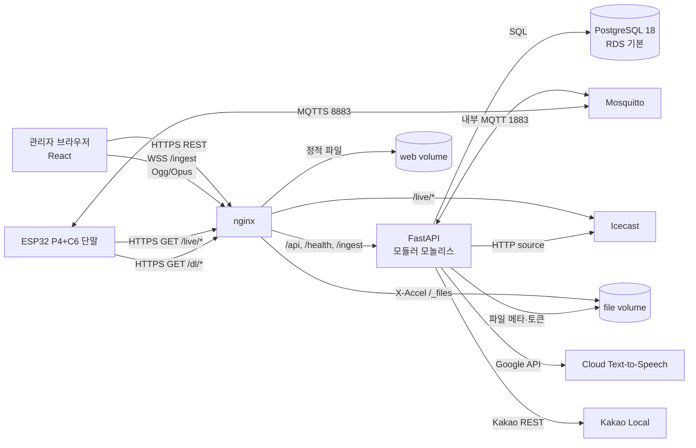
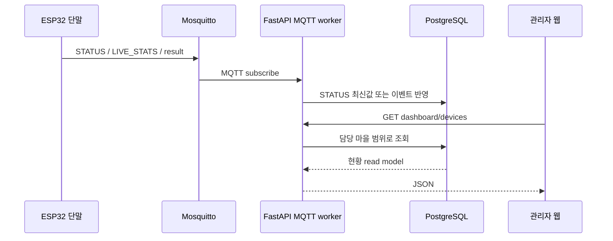
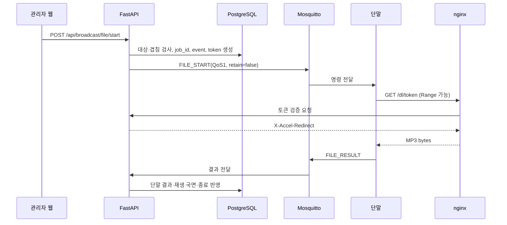
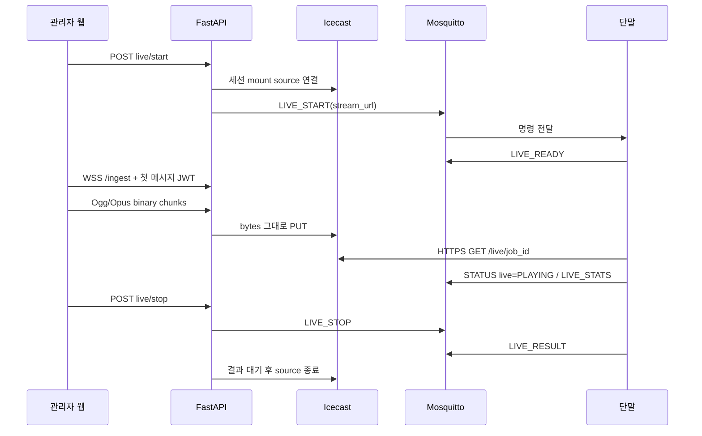

# xWIFI 시스템 아키텍처

기준일: 2026-09-06

관련 문서: [단말 연동](02_단말_연동_사양.md) · [API](03_백엔드_API.md) · [데이터 모델](04_데이터_모델.md) · [인프라](06_인프라_운영.md)

## 1. 목적과 범위

xWIFI는 군청 또는 마을 관리자가 웹에서 대상을 선택해 ESP32 기반 방송 단말로 실시간 음성이나 음원 파일을 송출하는 시스템이다. 단말 제어와 결과 수집에는 MQTT, 라이브 오디오 fan-out에는 Icecast, 파일 전달에는 HTTPS를 사용한다.

운영 단위는 **고객 1곳당 독립 스택 1벌**이다. 고객별 서버·DB·브로커·저장소를 분리해 장애 범위와 데이터 경계를 단순하게 유지한다.

현재 한 고객의 명목 운영 규모는 약 300대이며, nginx·Mosquitto·Icecast와 STATUS 저장 경로는 최대 약 3,000대 동시 연결을 목표로 여유를 둔다. 이 수치는 부하 시험을 대체하지 않는다.

## 2. 전체 구성



### 2.1 구성요소 책임

| 구성요소 | 책임 | 영속 상태 |
|---|---|---|
| React 관리자 웹 | 로그인, 현황·지도, 단말 등록, 방송 제어, 파일·TTS 관리 | JWT를 현재 `localStorage`에 보관 |
| nginx | TLS 종료, SPA 제공, API/WSS/Icecast 프록시, 파일 바이트 전송, 로그인 속도 제한 | 인증서와 정적 볼륨 |
| FastAPI | 인증·권한, CRUD, 대상 해석, 방송 수명주기, MQTT 처리, CONFIG 재조정 | DB, 파일 볼륨 |
| MQTT worker | STATUS·결과 구독, DB 반영, 명령·CONFIG 발행 | FastAPI 프로세스 내부 |
| scheduler | CONFIG 기동 즉시·주기 재발행 | FastAPI 프로세스 내부 |
| live registry | 진행 중 라이브 source, mount, WSS 업링크 상태 | 프로세스 메모리; 재시작 시 소실 |
| PostgreSQL 18 | 조직·권한·단말·파일 메타·방송 이력·설정 | RDS 기본, 로컬 프로필 선택 가능 |
| Mosquitto 2 | 명령·CONFIG 전달, 결과·상태 수집, LWT 발행 | 세션·retained 메시지·계정 해시·ACL |
| Icecast | 세션별 실시간 오디오 fan-out | 방송 중 연결 상태만 보유 |
| 파일 볼륨 | 업로드·TTS 음원 보관 | `FILE_ROOT` 아래 상대 경로로 관리 |
| Google Cloud TTS | 텍스트를 방송용 MP3로 합성 | 서버는 결과 MP3와 메타데이터를 보관 |
| Kakao | 주소 검색, 법정동코드·좌표, 지도 SDK | DB가 선택 결과의 정본 |

## 3. 서버 애플리케이션 구조

백엔드는 여러 독립 서비스가 아니라 **단일 FastAPI 프로세스 안의 모듈러 모놀리스**다.

```text
FastAPI process
├─ REST API
│  ├─ auth
│  ├─ org: villages, zones, users
│  ├─ device
│  ├─ file + TTS
│  ├─ broadcast
│  ├─ dashboard
│  ├─ geo
│  └─ system
├─ MQTT connection + publisher + handlers
├─ STATUS write buffer
├─ APScheduler: CONFIG reconcile
└─ live registry + Icecast sources + WSS ingest
```

이 구조에서는 방송 프로세스가 여러 worker로 분산되지 않는 것이 중요하다. 진행 중인 Icecast source와 업링크 소유권이 메모리에 있으므로, 현재 배포는 백엔드 한 프로세스가 전제다. 수평 확장하려면 라이브 세션 소유권과 메시지 라우팅을 외부 저장소·작업 큐로 먼저 분리해야 한다.

기동 시 백엔드는 다음 순서로 상태를 복구한다.

1. 파일 디렉터리를 준비한다.
2. MQTT 연결과 STATUS 버퍼를 시작한다.
3. CONFIG 재조정 스케줄러를 시작하고 즉시 한 번 실행한다.
4. DB의 단말 계정을 Mosquitto passwd·ACL 파일로 다시 내보낸다.
5. 서버 재시작 전부터 `ended_at IS NULL`인 방송을 고아 이벤트로 종료 처리한다. 해당 이벤트의 전송량은 신뢰할 수 없어 `bytes_estimated`를 비워 둔다.

## 4. 핵심 데이터 흐름

### 4.1 단말 상태 수집



- 주기 STATUS는 매 메시지마다 별도 트랜잭션을 열지 않고 기본 1초 동안 모아 쓴다.
- 온라인은 `last_seen_at`이 기본 300초 이내이고 최근 상태가 `OFFLINE`이 아닐 때로 계산한다.
- STATUS는 누적 이력 테이블에 저장하지 않고 `devices.last_status`의 최신값만 유지한다.
- LIVE_STATS와 OTA_PROGRESS는 방송·단말당 최신 한 행을 갱신한다.
- 1회성 결과는 `device_events`에 남기며 QoS 1 중복은 `dedup_key`로 방어한다.

### 4.2 파일 방송



백엔드는 토큰만 판정하고, 실제 MP3 바이트는 nginx가 `sendfile`로 전송한다. 이 구조는 다수 단말이 동시에 파일을 받을 때 Python worker가 파일 스트림에 묶이지 않게 한다.

### 4.3 실시간 방송



마이크 오디오는 브라우저에서 16 kHz mono, 24 kbps, 40 ms Ogg/Opus로 만들어진다. 서버는 오디오를 다시 인코딩하거나 파싱하지 않고 Icecast로 전달한다.

`LIVE_READY ok=true`는 단말의 오디오 출력 준비 완료이며, 스트림 재생 성공을 뜻하지 않는다. 실제 재생은 `STATUS.live=PLAYING`, 실패는 후속 `LIVE_RESULT`, 품질은 `LIVE_STATS`로 판단한다.

## 5. 대상 모델과 동시성

방송 대상 범위는 네 가지다.

| 범위 | API `target_ids` | MQTT 발행 방식 |
|---|---|---|
| `device` | MAC 목록 | 단말별 `device/<mac>/cmd` |
| `zone` | DB 구역 ID 목록 | 서버가 온라인 단말로 펼쳐 단말별 발행 |
| `village` | DB 마을 ID 목록 | 마을별 `village/<마을 토큰>/cmd` |
| `all` | 빈 목록 | `all/cmd`; `super_admin`만 허용 |

한 요청에 최대 200개 ID를 받을 수 있다. 실제 발행 대상은 시작 순간 온라인이면서 MQTT credential이 있는 단말로 확정하고 `expected_count`에 고정한다.

대상이 겹치는 진행 중 방송은 허용하지 않는다. 서버는 트랜잭션 advisory lock과 `ended_at IS NULL` 이벤트 검사를 사용하며, 기존 방송을 자동으로 끊지 않고 `409 BROADCAST_OVERLAP`을 반환한다.

동시에 진행할 수 있는 예시는 다음과 같다.

- 서로 다른 마을 A와 B의 별도 방송: 가능
- 같은 마을 일부 단말과 그 마을 전체 방송: 대상이 겹치므로 거부
- 전체 방송과 어떤 개별 방송: 대상이 겹치므로 거부
- 같은 요청으로 여러 마을에 동일 방송: 하나의 `job_id`, 하나의 Icecast mount를 공유해 가능

## 6. 식별자와 정본

| 데이터 | 정본 | 파생·캐시 |
|---|---|---|
| 사용자·담당 마을 | PostgreSQL | JWT에는 사용자 ID·역할을 담지만 매 요청에서 DB 사용자를 확인 |
| 마을 | `villages` | MQTT에는 `village_token`을 사용 |
| 단말 MQTT 계정 | `devices.mqtt_password` | Mosquitto passwd는 PBKDF2 해시로 전체 재생성 |
| 단말 ACL | 단말의 현재 마을 배정 | Mosquitto ACL 파일로 전체 재생성 |
| 공통·단말 CONFIG | `current_config`와 단말 배정 | retained MQTT는 전달 캐시 |
| 온라인 상태 | `last_seen_at`, `last_status` | API 응답 시 계산 |
| 파일 메타 | `files` | 실제 바이트는 파일 볼륨 |
| 방송 상태 | `broadcast_events`, `device_events` | 라이브 source/WSS 연결은 메모리 레지스트리 |
| 주소·좌표·경계 | PostgreSQL | Kakao 응답과 공공 경계 파일은 입력 자료 |

## 7. 보안 경계

### 7.1 관리자 경계

- 모든 관리자 API는 `/health`, `/dl/<token>`, WebSocket 연결 자체를 제외하고 JWT가 필요하다.
- WSS 업링크는 연결 후 10초 안에 첫 텍스트 메시지로 JWT를 인증한다.
- `super_admin`은 모든 마을과 미배정 단말을 관리한다.
- `village_admin`은 `user_villages`에 지정된 마을만 조회·제어한다.
- 권한은 React 메뉴 숨김과 무관하게 FastAPI scope에서 강제한다.
- 비밀번호는 bcrypt 해시로 저장한다.

### 7.2 단말 경계

- 운영 단말은 MQTTS 8883과 HTTPS 443만 사용한다.
- 단말마다 MAC 기반 username과 임의 8자 비밀번호를 발급한다.
- 단말은 자기 명령·CONFIG를 읽고 자기 상태·결과만 쓸 수 있다.
- 마을 배정 단말은 정확히 자기 마을 명령 토픽 하나만 추가로 읽는다.
- 서버 MQTT 계정만 `iotradio/#`를 읽고 쓸 수 있다.
- 서버 인증서는 nginx와 Mosquitto가 공유하며 full chain과 TLS 1.2 이상을 사용한다.
- 현재는 클라이언트 인증서를 요구하지 않고 username/password로 단말을 인증한다.

### 7.3 저장·다운로드 경계

- 관리자 미리듣기는 JWT 헤더 또는 제한적으로 `access_token` query를 사용한다.
- 단말 다운로드 토큰은 기본 600초 후 만료된다.
- 유효하지 않거나 만료된 단말 토큰은 자원 존재 여부를 숨기기 위해 404를 반환한다.
- 파일 경로는 DB에 `FILE_ROOT` 기준 상대 경로로 저장한다.
- nginx 내부 경로 `/_files/`는 외부에서 직접 호출할 수 없다.

## 8. 외부 의존성

| 의존성 | 사용 목적 | 장애 시 영향 |
|---|---|---|
| PostgreSQL/RDS | 모든 영속 상태 | 로그인·조회·제어 불가 |
| Mosquitto | 단말 명령·상태 | 새 명령 불가, 단말은 연결 복구 후 STATUS 재발행 |
| Icecast | 실시간 오디오 | 해당 라이브 방송 무음·단말 재접속 또는 실패 |
| Google Cloud TTS | 새 TTS 합성 | 기존 파일 방송은 가능, 새 합성만 실패 |
| Kakao Local | 주소 검색 | 수동 위치 입력·기존 데이터 사용은 가능 |
| Kakao Maps | 지도 렌더링 | 목록·수치 조회는 가능, 지도만 비활성 |
| DNS·Let's Encrypt | 운영 TLS | 신규 연결·갱신 실패 가능 |

## 9. 구현 경계와 확장 조건

현재 구현에 포함되지 않은 기능은 다음과 같다.

- 스케줄 CRUD, 정시 실행기, 재시도와 중복 실행 방지
- OTA 패키지 업로드, 서명·검증, 작업 생성, 진행 화면
- 전체 방송 이력의 검색·필터·내보내기
- 비용 집계 배치와 앱 내부 비용 조회
- 다중 백엔드 worker와 무중단 라이브 세션 이동

이 기능을 추가할 때 지켜야 할 경계는 다음과 같다.

- 스케줄 실행도 수동 방송과 같은 대상 해석·겹침 검사·`job_id` 발번 경로를 사용한다.
- OTA도 단말 wire contract의 `job_id`, `OTA_START`, `OTA_PROGRESS`, `OTA_RESULT`를 사용한다.
- 이력 조회는 `broadcast_events`와 `device_events`를 정본으로 사용하며 STATUS를 이벤트처럼 무한 적재하지 않는다.
- 수평 확장 전에 live registry와 MQTT 처리의 단일 소유권을 설계한다.
- 고객 통합형 멀티테넌시로 전환하려면 모든 테이블·토픽·저장 경로에 tenant 경계를 추가해야 하며, 현재 구조에서 단순히 서버만 공유해서는 안 된다.
