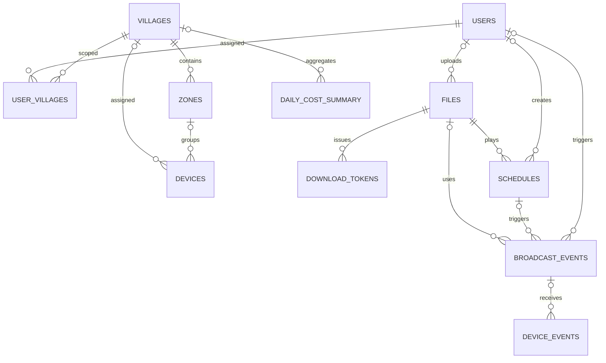

# xWIFI 데이터 모델

기준일: 2026-09-06

DBMS: PostgreSQL 18

스키마 기준: Alembic `0012` 적용 결과 + SQLAlchemy 모델

관련 문서: [아키텍처](01_시스템_아키텍처.md) · [API](03_백엔드_API.md)

## 1. 개요

현재 운영 스키마는 12개 테이블과 `job_id_seq` 시퀀스로 구성된다.

| 도메인 | 테이블 |
|---|---|
| 조직·권한 | `users`, `villages`, `zones`, `user_villages` |
| 단말 | `devices` |
| 파일 | `files`, `download_tokens` |
| 자동 방송 | `schedules` |
| 이력 | `broadcast_events`, `device_events` |
| 시스템·비용 | `current_config`, `daily_cost_summary` |

`schedules`와 `daily_cost_summary`는 스키마는 있지만 앱 기능이 아직 구현되지 않았다. OTA package 전용 테이블은 아직 없다.

## 2. 관계도

점선처럼 느슨한 관계가 필요한 곳은 의도적으로 FK를 걸지 않는다. 대표적으로 `device_events.mac`은 단말 삭제 후에도 과거 방송 이력을 남기기 위해 문자열만 보관한다.

## 3. 공통 표기와 규칙

- `timestamptz`는 timezone-aware 시각이다.
- 생성 시각 기본값은 DB `now()`다.
- `target_ids`는 scope에 맞는 ID 문자열 배열을 JSONB로 저장한다.
- 파일 본문은 DB에 넣지 않고 파일 볼륨에 둔다.
- STATUS 원본은 최신값만 `devices.last_status`에 저장한다.
- 단말 이벤트 payload는 프로토콜 필드 추가에 유연하도록 JSONB 원본을 보존한다.
- PK 자동 증가는 PostgreSQL identity/sequence 동작을 사용한다.
- 스키마 변경은 모델만 고치지 않고 Alembic upgrade·downgrade를 함께 제공한다.

## 4. 조직·권한

### 4.1 `users`

관리자 계정이다.

| 컬럼 | 타입 | NULL | 기본/제약 | 의미 |
|---|---|---:|---|---|
| `id` | integer | 아니오 | PK | 내부 사용자 ID |
| `username` | varchar(50) | 아니오 | UNIQUE | 로그인 ID |
| `password_hash` | varchar(255) | 아니오 | bcrypt | 비밀번호 해시 |
| `role` | varchar(20) | 아니오 | CHECK `super_admin`, `village_admin` | 권한 역할 |
| `created_at` | timestamptz | 아니오 | `now()` | 생성 시각 |

규칙:

- `super_admin`은 `user_villages`를 보지 않고 전체 접근한다.
- `village_admin`만 `user_villages`로 범위를 제한한다.
- username 입력 제약과 비밀번호 길이 검증은 API에서 추가로 수행한다.
- 마지막 `super_admin`과 현재 로그인 사용자 자신의 계정은 API에서 삭제를 막는다.

### 4.2 `villages`

운영의 최상위 방송 그룹이다.

| 컬럼 | 타입 | NULL | 기본/제약 | 의미 |
|---|---|---:|---|---|
| `id` | integer | 아니오 | PK | DB 관계·API에 쓰는 내부 ID |
| `name` | varchar(100) | 아니오 |  | 마을/방송 그룹 이름 |
| `sido` | varchar(50) | 예 |  | 시·도 |
| `sigungu` | varchar(50) | 예 |  | 시·군·구 |
| `address_detail` | varchar(255) | 예 |  | 추가 주소 설명 |
| `b_code` | varchar(10) | 예 | API에서 10자리 숫자 검증 | 법정동코드, 경계 join key |
| `village_code` | varchar(12) | 예 | UNIQUE | MQTT용 법정동 10자리 + 그룹 연번 2자리 |
| `road_address` | varchar(255) | 예 |  | 대표 도로명 주소 |
| `jibun_address` | varchar(255) | 예 |  | 대표 지번 주소 |
| `boundary` | jsonb | 예 | GeoJSON geometry | WGS84 마을 경계 |
| `lat` | double precision | 예 | API 위도 범위 검증 | 대표 위도 |
| `lng` | double precision | 예 | API 경도 범위 검증 | 대표 경도 |
| `created_at` | timestamptz | 아니오 | `now()` | 생성 시각 |

`village_code`가 있으면 MQTT 마을 토큰으로 그대로 사용하고, 없으면 `id`를 8자리로 0 패딩한다. `village_code`는 생성 후 주소의 `b_code`가 바뀌어도 유지한다. 경계는 `b_code`로 원천 자료와 조인하지만 좌표계 변환 후 GeoJSON을 DB에 직접 저장한다. 공간 질의가 필요하지 않아 PostGIS를 사용하지 않는다.

마을 삭제 시:

- `zones`, `user_villages`, `daily_cost_summary`의 해당 마을 행은 CASCADE 삭제된다.
- 소속 `devices.village_id`는 NULL이 된다.
- zone도 함께 삭제되므로 `devices.zone_id`도 NULL이 된다.
- 백엔드는 MQTT ACL과 retained 단말 CONFIG를 미배정 상태로 동기화한다.

### 4.3 `zones`

마을 하위의 서버 내부 대상 그룹이다.

| 컬럼 | 타입 | NULL | 기본/제약 | 의미 |
|---|---|---:|---|---|
| `id` | integer | 아니오 | PK | 구역 ID |
| `village_id` | integer | 아니오 | FK `villages.id` ON DELETE CASCADE, INDEX | 소속 마을 |
| `name` | varchar(100) | 아니오 |  | 구역명 |
| `address_detail` | varchar(255) | 예 |  | 설명 |
| `lat` | double precision | 예 |  | fallback 위도 |
| `lng` | double precision | 예 |  | fallback 경도 |
| `created_at` | timestamptz | 아니오 | `now()` | 생성 시각 |

zone은 단말로 전달하지 않는다. zone 방송 시 서버가 `devices.zone_id`로 MAC을 조회해 개별 명령 토픽으로 펼친다.

### 4.4 `user_villages`

`village_admin`과 담당 마을의 다대다 연결이다.

| 컬럼 | 타입 | NULL | 기본/제약 |
|---|---|---:|---|
| `user_id` | integer | 아니오 | PK 일부, FK `users.id` ON DELETE CASCADE |
| `village_id` | integer | 아니오 | PK 일부, FK `villages.id` ON DELETE CASCADE |

복합 PK가 같은 배정의 중복을 막는다.

## 5. 단말

### 5.1 `devices`

ESP32 P4+C6 한 대의 등록정보와 최신 상태 캐시다.

| 컬럼 | 타입 | NULL | 기본/제약 | 의미 |
|---|---|---:|---|---|
| `mac` | varchar(12) | 아니오 | PK | 콜론 없는 소문자 MAC |
| `label` | varchar(100) | 예 |  | 운영자 표시명 |
| `village_id` | integer | 예 | FK `villages.id` ON DELETE SET NULL, INDEX | 마을 배정 |
| `zone_id` | integer | 예 | FK `zones.id` ON DELETE SET NULL, INDEX | 구역 배정 |
| `firmware_version` | varchar(50) | 예 |  | 호환용 통합 버전 필드 |
| `p4_model` | varchar(50) | 예 |  | 등록 당시 P4 모델 |
| `p4_version` | varchar(50) | 예 |  | 등록 당시 P4 버전 |
| `c6_model` | varchar(50) | 예 |  | 등록 당시 C6 모델 |
| `c6_version` | varchar(50) | 예 |  | 등록 당시 C6 버전 |
| `road_address` | varchar(255) | 예 |  | 설치 도로명 주소 |
| `jibun_address` | varchar(255) | 예 |  | 설치 지번 주소 |
| `address_detail` | varchar(100) | 예 |  | 동·호·위치 설명 |
| `lat` | double precision | 예 |  | 설치 위도 |
| `lng` | double precision | 예 |  | 설치 경도 |
| `mqtt_password` | varchar(16) | 예 |  | 단말별 broker password 원본 |
| `last_status` | jsonb | 예 |  | 가장 최근 STATUS/LWT payload |
| `last_seen_at` | timestamptz | 예 | INDEX | 최근 상태·결과 수신 시각 |
| `registered_at` | timestamptz | 아니오 | `now()` | 등록 시각 |

모델·버전 두 종류를 구분한다.

- `p4_version`, `c6_version`: QR 등록 시점 값
- `last_status.p4_fw`, `last_status.c6_fw`: 현재 실행 중인 firmware 보고값

`mqtt_password`는 단말 생산 주입 시 다시 보여줘야 하므로 서버 DB에서 평문을 보관한다. 이 컬럼 접근은 최소 권한으로 제한하고 DB 암호화·접근통제·backup 보호가 필요하다. broker에 내보내는 passwd에는 해시만 쓴다.

온라인 여부는 컬럼으로 저장하지 않는다. `last_seen_at`이 현재 시각에서 기본 300초 이내이고 `last_status.state != OFFLINE`인지 API 조회 시 계산한다.

지도 위치는 다음 우선순위로 읽는다.

1. `devices.lat/lng`
2. 소속 `zones.lat/lng`
3. 소속 `villages.lat/lng`
4. 모두 없으면 지도 미표시

상위 좌표를 단말 행에 복사하지 않으므로 상위 위치 변경이 즉시 반영된다.

## 6. 파일

### 6.1 `files`

방송 음원의 메타데이터다. 파일 bytes는 저장소에 둔다.

| 컬럼 | 타입 | NULL | 기본/제약 | 의미 |
|---|---|---:|---|---|
| `id` | integer | 아니오 | PK | 파일 ID |
| `filename` | varchar(255) | 아니오 |  | 관리자 표시 파일명 |
| `size_bytes` | bigint | 아니오 |  | byte 크기 |
| `sha256` | char 성격 varchar(64) | 아니오 |  | 실제 bytes 해시 |
| `source` | varchar(20) | 아니오 | 기본 `upload`, CHECK `upload`, `tts` | 생성 경로 |
| `storage_path` | varchar(500) | 아니오 |  | `FILE_ROOT` 기준 상대 경로 |
| `duration_sec` | numeric(8,2) | 예 |  | 재생 길이 |
| `tts_text` | text | 예 |  | TTS 원문 |
| `tts_lang` | varchar(10) | 예 |  | TTS 언어 |
| `tts_voice` | varchar(50) | 예 |  | TTS voice ID |
| `uploaded_by` | integer | 예 | FK `users.id` | 등록 사용자 |
| `created_at` | timestamptz | 아니오 | `now()` | 생성 시각 |

현재 DB CHECK는 `source`에 `upload`, `tts`만 허용한다. OTA 파일을 이 테이블에 넣으려면 `update` 같은 값을 코드에 먼저 쓰지 말고 migration으로 제약과 모델을 함께 확장하거나 OTA 전용 테이블을 설계해야 한다.

TTS cache key는 애플리케이션에서 `(tts_text, tts_lang, tts_voice)`로 찾는다. DB UNIQUE 제약은 없으므로 동시 합성 중복을 완전히 막으려면 추후 인덱스 또는 lock이 필요하다.

파일 삭제는 다음을 만족해야 한다.

- 참조 중인 schedule·broadcast가 있으면 API가 `FILE_IN_USE`로 거부한다.
- DB 행과 실제 파일을 함께 정리한다.
- 파일 시스템 경로는 상대 경로만 저장해 배포 위치 변경에 견딘다.

### 6.2 `download_tokens`

단말이 파일을 짧은 URL로 받기 위한 만료 token이다.

| 컬럼 | 타입 | NULL | 기본/제약 | 의미 |
|---|---|---:|---|---|
| `token` | varchar(64) | 아니오 | PK | URL token |
| `file_id` | integer | 아니오 | FK `files.id` ON DELETE CASCADE, INDEX | 대상 파일 |
| `job_id` | bigint | 예 |  | 발급 원인 방송 ID |
| `expires_at` | timestamptz | 아니오 | INDEX | 만료 시각 |
| `created_at` | timestamptz | 아니오 | `now()` | 발급 시각 |

토큰은 첫 요청에 소비되는 1회용이 아니다. 단말의 Range 재시도가 끝날 때까지 같은 URL로 여러 번 사용할 수 있어야 한다. 기본 TTL은 600초다.

## 7. 자동 방송

### 7.1 `schedules`

스키마는 존재하지만 현재 API·실행기·화면은 구현되지 않았다.

| 컬럼 | 타입 | NULL | 기본/제약 | 의미 |
|---|---|---:|---|---|
| `id` | integer | 아니오 | PK | 스케줄 ID |
| `months` | integer[] | 아니오 | API에서 1~12 검증 예정 | 실행 월 |
| `weekdays` | integer[] | 아니오 | 0=일~6=토 | 실행 요일 |
| `times` | time[] | 아니오 |  | 하루 실행 시각 목록 |
| `file_id` | integer | 아니오 | FK `files.id` | 방송 파일 |
| `target_scope` | varchar(20) | 아니오 | CHECK `device`, `zone`, `village`, `all` | 대상 범위 |
| `target_ids` | jsonb | 아니오 | 기본 `[]` | 대상 ID 문자열 목록 |
| `enabled` | boolean | 아니오 | 기본 true | 사용 여부 |
| `created_by` | integer | 예 | FK `users.id` | 생성 사용자 |
| `created_at` | timestamptz | 아니오 | `now()` | 생성 시각 |

구현 시 필요한 DB 보강 후보:

- timezone 또는 고객 timezone의 명시적 규칙
- 마지막 실행 시각과 다음 실행 시각
- 같은 분 중복 실행을 막는 unique execution key
- 실행 성공·skip·실패를 방송 이벤트와 연결하는 규칙
- 최대 10개 제한을 API만 둘지 DB 제약으로 둘지 결정

스케줄 실행은 새 전송 경로를 만들지 않고 수동 파일 방송과 같은 대상 해석·겹침 검사·이벤트 저장을 재사용해야 한다.

## 8. 방송·단말 이력

### 8.1 `broadcast_events`

서버가 발행한 방송 작업 한 건이다.

| 컬럼 | 타입 | NULL | 기본/제약 | 의미 |
|---|---|---:|---|---|
| `id` | bigint | 아니오 | PK | API의 `broadcast_id` |
| `event_type` | varchar(20) | 아니오 |  | `LIVE_START`, `FILE_START` 등 |
| `job_id` | bigint | 예 | INDEX | 단말 wire 작업 ID |
| `target_scope` | varchar(20) | 아니오 | CHECK 4 scope | 대상 종류 |
| `target_ids` | jsonb | 아니오 | 기본 `[]` | 요청한 대상 ID 목록 |
| `file_id` | integer | 예 | FK `files.id` | FILE 방송 파일 |
| `schedule_id` | integer | 예 | FK `schedules.id` | 자동 방송 원인 |
| `triggered_by` | integer | 예 | FK `users.id` | 수동 실행 사용자 |
| `triggered_at` | timestamptz | 아니오 | `now()`, INDEX | 시작 시각 |
| `ended_at` | timestamptz | 예 | active partial INDEX | 종료 확정 시각 |
| `stop_requested_at` | timestamptz | 예 |  | 중지 요청 시각 |
| `expected_count` | integer | 예 |  | 발행 순간 대상 단말 수 |
| `autoplay` | boolean | 예 |  | FILE 자동 재생 여부 |
| `playing_since` | timestamptz | 예 |  | FILE 재생 국면 시작 |
| `bytes_estimated` | bigint | 예 |  | 종료 시 계산한 전송량 추정치 |

`ended_at IS NULL`이면 진행 중이다. 이 조건에 partial index가 있으며 대상 겹침 검사에서 사용한다.

`target_ids`는 요청의 논리 대상을 저장한다.

- `device`: MAC 목록
- `zone`: DB zone ID 문자열 목록
- `village`: DB village ID 문자열 목록
- `all`: 빈 목록

현재는 실제 발행한 MAC 전체 snapshot을 별도 컬럼에 저장하지 않는다. 시작 시점의 대수만 `expected_count`에 고정하고, 응답한 MAC은 `device_events`로 알 수 있다. 따라서 미응답 단말의 원래 MAC 목록은 방송이 끝난 뒤 완전하게 복원할 수 없다. 감사용 전체 이력을 구현할 때 대상 snapshot 보강이 필요하다.

`bytes_estimated`는 단말 실측이 아니다.

- FILE: `files.size_bytes × 결과를 남긴 고유 MAC 수`
- LIVE: `지속시간 초 × 3,000 bytes/sec × 결과를 남긴 고유 MAC 수`
- 서버 재시작으로 고아 정리된 이벤트: NULL

명령을 받았지만 결과를 보내지 못한 단말은 계산에서 빠질 수 있으므로 하한에 가까운 참고값이다.

`triggered_by`와 `schedule_id`는 수동·자동 원인을 나누기 위한 필드다. 현재는 수동 방송만 구현되어 `triggered_by`를 사용한다.

### 8.2 `device_events`

한 방송에 대한 단말 한 대의 결과 또는 최신 텔레메트리다.

| 컬럼 | 타입 | NULL | 기본/제약 | 의미 |
|---|---|---:|---|---|
| `id` | bigint | 아니오 | PK | 이벤트 ID |
| `event_id` | bigint | 예 | FK `broadcast_events.id` ON DELETE CASCADE, INDEX | 연결 방송 |
| `mac` | varchar(12) | 아니오 | INDEX, FK 없음 | 응답 단말 |
| `result_type` | varchar(20) | 예 |  | 메시지 type |
| `payload` | jsonb | 아니오 |  | MQTT 원본 |
| `received_at` | timestamptz | 아니오 | `now()`, INDEX | 수신 시각 |
| `dedup_key` | varchar(140) | 예 | NULL 제외 UNIQUE INDEX | QoS 1 멱등 키 |

`mac`에 `devices` FK가 없는 것은 의도적이다. 도난·폐기 단말을 삭제해도 과거 방송 결과는 남아야 한다.

저장 정책:

| 메시지 | 저장 방식 |
|---|---|
| 주기 STATUS·LWT | `devices.last_status` 최신값으로 저장, 여기에 누적하지 않음 |
| LIVE_STATS | 방송·단말당 최신 한 행을 upsert |
| OTA_PROGRESS | 작업·단말당 최신 한 행을 upsert |
| LIVE_READY | 1회성 결과로 저장; 같은 job에서 후속 실패도 별도 보존 가능 |
| LIVE_RESULT, FILE_RESULT, OTA_RESULT | 최종 결과 행 저장 |

`dedup_key`의 기본 형식은 `<mac>:<result_type>:<job_id>`다. `job_id`를 추출할 수 없는 메시지는 NULL로 두며 unique 검사를 하지 않는다.

`event_id`가 NULL일 수 있는 이유는 이벤트와 연결하지 못한 수신 메시지를 보존할 수 있게 하기 위해서다. 다만 종료 이벤트의 늦은 주기 텔레메트리는 현재 상태를 되살리지 않도록 저장하지 않는다.

## 9. 시스템·비용

### 9.1 `current_config`

항상 `id=1` 한 행만 존재하는 singleton이다.

| 컬럼 | 타입 | NULL | 기본/제약 | 의미 |
|---|---|---:|---|---|
| `id` | integer | 아니오 | PK, CHECK `id=1`, 기본 1 | singleton key |
| `config_version` | integer | 아니오 | 기본 1 | 단말 CONFIG 버전 |
| `status_interval_sec` | integer | 아니오 | 기본 30 | STATUS 주기 |
| `live_stats_interval_sec` | integer | 아니오 | 기본 10 | LIVE_STATS 주기 |
| `event_qos` | smallint | 아니오 | 기본 0 | 주기 이벤트 QoS |
| `live_ready_timeout_sec` | smallint | 아니오 | 기본 30 | LIVE 준비 제한 |
| `live_stop_wait_sec` | smallint | 아니오 | 기본 10 | LIVE 중지 결과 대기 |
| `file_wait_sec` | smallint | 아니오 | 기본 30 | FILE 시작·중지 결과 대기 |
| `updated_at` | timestamptz | 아니오 | `now()` | 수정 시각 |

DB는 주로 기본값과 singleton만 강제하고, 상세 범위는 API가 검사한다.

| 필드 | API 범위 |
|---|---:|
| `status_interval_sec` | 10~3600 |
| `live_stats_interval_sec` | 1~60 |
| `event_qos` | 0~1 |
| `live_ready_timeout_sec` | 1~60 |
| `live_stop_wait_sec` | 10~30 |
| `file_wait_sec` | 10~60 |

공통 CONFIG의 세 필드가 바뀔 때만 `config_version`을 올린다. 서버 내부 방송 대기시간 변경은 단말 공통 설정이 아니므로 버전을 올리지 않는다.

### 9.2 `daily_cost_summary`

스키마는 존재하지만 앱 집계 배치와 조회 API는 아직 구현되지 않았다.

| 컬럼 | 타입 | NULL | 기본/제약 | 의미 |
|---|---|---:|---|---|
| `id` | bigint | 아니오 | PK | 행 ID |
| `summary_date` | date | 아니오 | INDEX | 집계일 |
| `village_id` | integer | 예 | FK `villages.id` ON DELETE CASCADE | NULL은 전체 계정 집계 |
| `broadcast_minutes` | numeric(10,2) | 아니오 | 기본 0 | 방송 시간 합계 |
| `device_broadcast_count` | integer | 아니오 | 기본 0 | 참여 단말 연인원 |
| `estimated_egress_mb` | numeric(12,2) | 예 |  | 이력 기반 전송량 추정 |
| `estimated_cost_krw` | numeric(10,2) | 예 |  | 마을 배분 추정 비용 |
| `actual_total_cost_krw` | numeric(10,2) | 예 |  | 전체 행의 AWS 실비용 |
| `created_at` | timestamptz | 아니오 | `now()` | 생성 시각 |

`(summary_date, village_id)`는 PostgreSQL `NULLS NOT DISTINCT` UNIQUE다. 따라서 `village_id IS NULL`인 전체 집계도 날짜마다 한 행만 존재한다.

AWS가 마을 단위 비용을 직접 제공하지 않으므로:

- 전체 행의 `actual_total_cost_krw`는 Cost Explorer 실비용
- 마을 행의 비용은 방송 이력과 추정 egress를 이용한 배분값

으로 구분해야 한다.

## 10. 시퀀스와 ID

`job_id_seq`는 LIVE, FILE, OTA가 공유하는 작업 ID 시퀀스다.

- 시작값 1
- 프로세스 메모리 counter를 쓰지 않음
- 서버 재시작·다중 요청에도 중복되지 않음
- `broadcast_events.id`와 `job_id`는 같은 의미가 아니며 값이 우연히 같을 필요도 없음
- API 중지 입력은 `broadcast_events.id`, 단말 MQTT 입력은 `job_id`

## 11. 삭제·보존 정책 요약

| 삭제 대상 | 연쇄 동작 |
|---|---|
| 사용자 | `user_villages` CASCADE; 다른 FK 참조가 있으면 정책 확인 필요 |
| 마을 | zones·user_villages·마을 비용 CASCADE, devices는 미배정 |
| 구역 | devices.zone_id는 NULL |
| 단말 | 과거 `device_events` 유지 |
| 파일 | download_tokens CASCADE; schedule·broadcast 참조 중이면 API에서 삭제 거부 |
| 방송 이벤트 | 연결 device_events CASCADE |

방송 이력의 법적·운영 보존 기간과 개인정보 삭제 기준은 아직 별도 정책으로 정해져 있지 않다. 임의 cleanup job을 추가하기 전에 보존 기간, 감사 요구, 백업 삭제 시점을 함께 결정해야 한다.

## 12. 마이그레이션 운용

현재 head는 `0012`다.

변경 절차:

1. SQLAlchemy 모델과 Pydantic/API 영향을 설계한다.
2. 새 Alembic revision을 만든다.
3. upgrade와 downgrade를 모두 작성한다.
4. 실제 PostgreSQL 18에서 `upgrade head → downgrade base → upgrade head`를 통과시킨다.
5. 기존 데이터 backfill과 NULL·기본값 처리를 검증한다.
6. 앱 테스트와 프론트 build를 실행한다.
7. 이 문서와 API·화면 문서를 같은 변경에 맞춘다.

운영 배포 스크립트는 새 컨테이너로 교체하기 전에 migration을 실행한다. migration이 실패하면 기존 서비스는 그대로 유지된다. destructive migration은 별도 백업·복구 시험 없이 배포하지 않는다.

## 13. 향후 스키마 작업

아래는 아직 필요한 현재 작업이다.

- OTA package, target firmware, 서명, 배포 작업과 재부팅 후 판정을 보관할 모델
- 스케줄 실행 중복 방지와 실행 결과 필드 또는 별도 테이블
- 이력 조회 성능을 위한 scope·기간 조건 인덱스 검토
- village_admin이 전체·zone·device 방송 참여 이력을 정확히 조회할 수 있는 대상 snapshot 구조
- TTS 동시 중복 합성을 방지하는 cache unique key
- 비용 집계 재실행을 위한 upsert·source version 필드
- 만료 `download_tokens` 정리 작업
- 방송·단말 이력 보존 기간과 archive 정책
