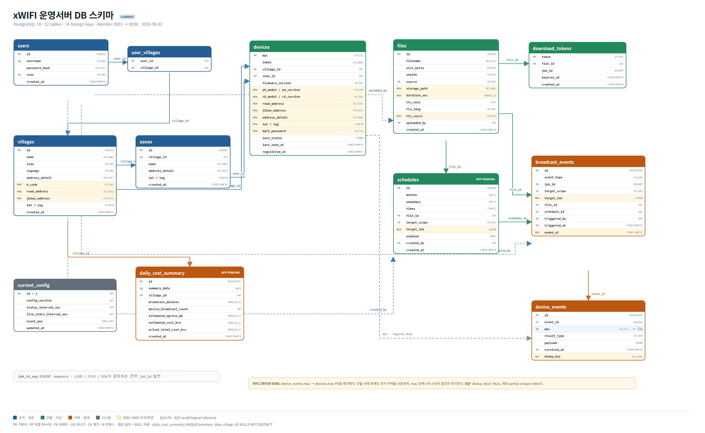

# xWIFI 운영서버 DB 스키마

> 기준일: 2026-09-02
>
> PostgreSQL 18 · 12 tables · 14 foreign keys · Alembic 0001 → 0006
>
> 실제 기준: `backend/app/models/`와 `backend/alembic/versions/`

- 편집 가능한 원본: [`../diagrams/xwifi-db-schema-260902.html`](../diagrams/xwifi-db-schema-260902.html)
- PNG: [`../xWIFI_ERD_260902.png`](../xWIFI_ERD_260902.png)

## 1. 테이블 구성

| 분류 | 테이블 | 역할 |
|---|---|---|
| 조직·권한 | `users` | 로그인 계정과 `super_admin`/`village_admin` 역할 |
| 조직·권한 | `villages` | 마을과 주소·좌표·법정동코드 |
| 조직·권한 | `zones` | 마을 하위 구역과 위치 |
| 조직·권한 | `user_villages` | 관리자가 접근할 수 있는 마을 범위 |
| 단말·자산 | `devices` | MAC 기반 단말, P4/C6 정보, 위치, MQTT 자격증명, 최신 상태 |
| 단말·자산 | `files` | 업로드·TTS·OTA 파일 메타데이터와 저장 경로 |
| 단말·자산 | `download_tokens` | 파일 방송용 단기 다운로드 토큰 |
| 방송·이력 | `schedules` | 자동방송 달력·시각·대상 목록; 애플리케이션 구현 예정 |
| 방송·이력 | `broadcast_events` | LIVE/FILE/OTA 작업 단위와 `job_id` |
| 방송·이력 | `device_events` | 작업별 단말 RESULT/STATUS 수신 이력 |
| 시스템 | `current_config` | 단일 행 CONFIG 버전과 전송 주기·QoS |
| 집계 | `daily_cost_summary` | 마을별 일간 방송량·트래픽·비용; 애플리케이션 구현 예정 |

OTA는 별도 작업 테이블을 만들지 않고 `files.source='update'`, `broadcast_events.event_type='OTA'`, `device_events`를 재사용한다.

## 2. 현재 스키마의 핵심 규칙

- `devices.mac`은 12자리 MAC 문자열 기본키다.
- LIVE, FILE, OTA의 식별자는 공용 PostgreSQL `job_id_seq`에서 발급한다.
- `schedules.target_ids`와 `broadcast_events.target_ids`는 복수 대상을 담는 JSONB다.
- 진행 중인 작업의 대상 겹침은 `broadcast_events`의 활성 작업 인덱스와 애플리케이션 advisory lock으로 막는다.
- `device_events.dedup_key`는 NULL이 아닌 경우에만 유일한 partial unique index를 사용해 QoS1 중복 수신을 제거한다.
- `device_events.mac`은 인덱스와 논리 참조만 유지한다. 단말 삭제 후에도 과거 이력을 보존하기 위해 `devices.mac` FK는 0006에서 제거했다.
- `daily_cost_summary`는 `(summary_date, village_id)`에 `NULLS NOT DISTINCT` 유일 제약을 둬 전체 합계도 날짜별 한 행만 허용한다.
- `current_config.id`는 1로 고정하는 단일 행 테이블이다.

## 3. 마이그레이션 이력

| 버전 | 변경 |
|---|---|
| 0001 | 12개 테이블, FK, 인덱스, `job_id_seq` 생성 |
| 0002 | 단일 `target_id`를 복수 `target_ids JSONB`로 변경 |
| 0003 | 단말별 `mqtt_password` 추가 |
| 0004 | `p4_model`, `p4_version`, `c6_model`, `c6_version` 추가 |
| 0005 | 마을의 `b_code`, 도로명/지번 주소와 단말 설치 위치 필드 추가 |
| 0006 | `device_events.mac → devices.mac` FK 제거, 조회 인덱스 유지 |

## 4. 초기 ERD와 달라진 부분

첨부된 2026-08-19 초기 ERD와 비교하면 테이블 수는 12개로 같지만, 단말 하드웨어·위치·MQTT 자격증명, 마을 주소 체계, 복수 대상 JSONB, 이벤트 종료 시각과 중복 방지 키가 추가되었다. 반대로 `device_events.mac`의 물리 FK는 삭제되었다. `schedules`와 비용 집계는 스키마만 준비된 상태라는 점도 도식에 표시했다.

`village_id`는 DB에서는 계속 정수 PK다. 최신 단말 등록 문서의 12자리 외부 표현과 현재 코드의 8자리 변환은 별도 프로토콜 정합성 과제로 관리한다.
