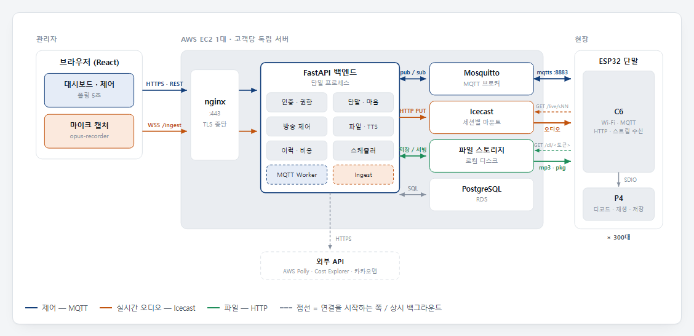
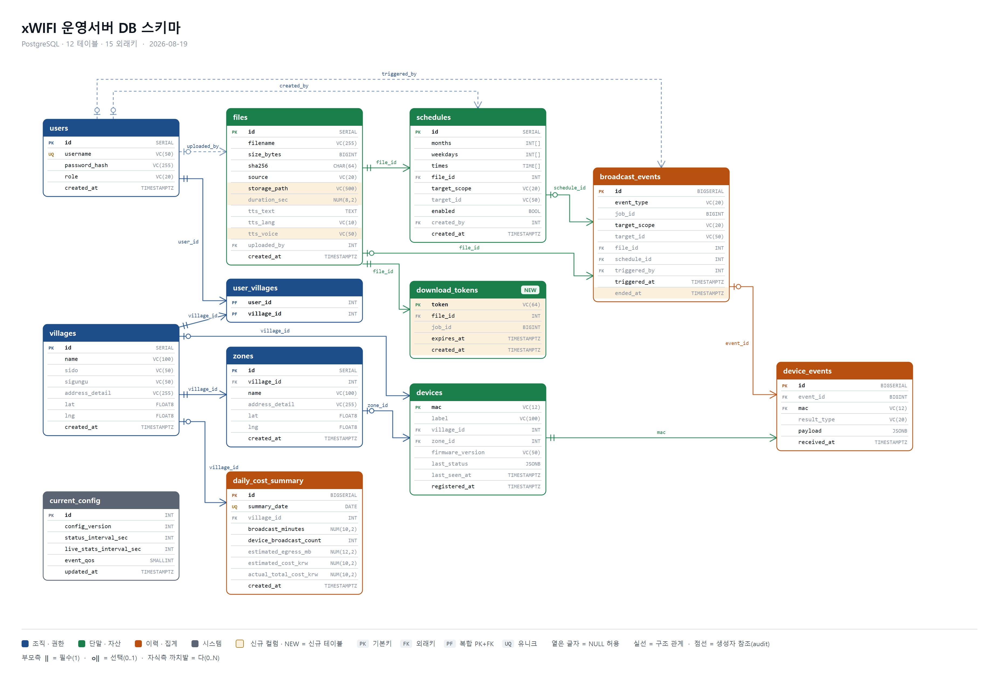

# xWIFI 운영서버 사양

ESP32 단말 300대 규모의 마을방송 시스템을 웹에서 제어하는 운영서버의 통합 사양. 아키텍처부터 구현 순서까지 영역별로 정리한다.

---

## 목차

1. [아키텍처](#1-아키텍처)
2. [서버 구성](#2-서버-구성)
3. [통신 사양](#3-통신-사양)
4. [DB 스키마](#4-db-스키마)
5. [API 명세](#5-api-명세)
6. [화면 설계](#6-화면-설계)
7. [구현 계획](#7-구현-계획)
8. [협의 필요](#8-협의-필요)

---

## 1. 아키텍처

### 배포 구조

관리자(브라우저) ↔ nginx(TLS) ↔ FastAPI 백엔드 ↔ Mosquitto, Icecast, 파일 스토리지, PostgreSQL

**고객당 독립 서버 1대**: AWS EC2에서 동일한 구성을 고객마다 통째로 복제. 고객 간 서버·브로커·DB 공유 없음.



### 3채널

| 채널 | 프로토콜 | 연결 주체 | 트리거 |
|------|---------|---------|--------|
| **제어** | MQTTS `:8883` | 단말이 접속, 상시 유지 | 부팅 직후 자동 |
| **실시간 오디오** | HTTPS GET (Icecast) | 단말이 `GET /live/sNN` | `LIVE_START` 수신 후 |
| **파일** | HTTPS GET | 단말이 `GET /dl/<토큰>` | `FILE_START` · `OTA_START` 수신 후 |

**원칙**: MQTT만 서버와 상시 연결을 유지한다. 오디오와 파일은 **단말이 직접 GET으로 가져간다** — 서버는 MQTT로 대상과 URL을 알려주는 역할만 한다.

### 오디오 업링크 경로

```
브라우저 마이크
  → opus-recorder (Ogg/Opus, 16kHz mono, 40ms, maxFramesPerPage=1)
  → WSS /ingest          (브라우저는 HTTP 요청 바디를 스트리밍할 수 없으므로 WebSocket)
  → 백엔드
  → HTTP PUT             (Icecast source 프로토콜)
  → Icecast /live/sNN
  → HTTPS GET            (단말은 WebSocket 스택 없이 순수 바이트 스트림만 읽음)
```

### 배포 단위

| 컨테이너 | 역할 | 온프레미스 전환 |
|---------|------|-----------------|
| **backend** | FastAPI · MQTT Worker · 스케줄러 · Ingest | 그대로 |
| **mosquitto** | MQTT 브로커 (TLS + ACL) | 그대로 |
| **icecast** | 실시간 오디오 fan-out | 그대로 |
| **nginx** | TLS 종단 · 리버스 프록시 (MQTT는 `stream{}`) | 인증서만 교체 |
| **postgres** | RDS 사용 시 컨테이너 없음 | 로컬 Postgres — `DATABASE_URL`만 변경 |

---

## 2. 서버 구성

### 기술 스택

| 영역 | 선택 |
|------|------|
| 백엔드 | Python 3.12 · FastAPI · `aiomqtt` |
| DB | PostgreSQL 16 (RDS) · `asyncpg` · SQLAlchemy 2.0 · Alembic |
| 스케줄러 | APScheduler |
| 프론트 | React 18 · TypeScript · Vite |
| 브로커 / 스트리밍 | Mosquitto · Icecast |
| TTS | AWS Polly (`boto3`) |
| 인프라 | Docker Compose |

### 권한 모델

**권한은 백엔드가 강제한다.** 모든 조회 API는 응답 생성 전에 담당 `village_id` 범위로 필터링하고, 제어 API는 대상이 범위를 벗어나면 403으로 거절한다. MQTT 발행 직전에 한 번 더 검사한다.

#### 메뉴별 권한

| 메뉴 | super_admin | village_admin |
|------|-------------|---------------|
| **대시보드** | 전체 | 담당 마을만 집계 |
| **단말 관리** | 전체 + 미배정 | 담당 마을 단말만 · 미배정 섹션 없음 |
| **방송 제어** | 전체 / 마을 / 구역 / 개별 | 담당 마을 이하 · "전체" 옵션 없음 |
| **파일함** | 전체 | 전체 공용 · 삭제는 본인 업로드만 |
| **이력** | 전체 | 담당 마을 관련 이벤트만 |
| **스케줄** | 전체 | 담당 마을 대상 규칙만 |
| **비용** | 실비용 + 마을별 추정 | 담당 마을 추정치만 |
| **OTA · 설정 · 마을 · 계정** | 가능 | 메뉴 없음 |

#### 발행 대상별 권한

| 발행 대상 | 토픽 | 허용 |
|----------|------|------|
| `all` | `iotradio/all/cmd` | super_admin만 |
| `village` | `iotradio/village/<8자리>/cmd` | 담당 마을이면 가능 |
| `zone` | 소속 단말 MAC별 개별 토픽으로 분할 | 담당 마을 소속이면 가능 |
| `device` | `iotradio/device/<mac>/cmd` | 담당 마을 소속이면 가능 |

### 위치 체계

- `village_id` — DB 자동 일련번호. MQTT로 나갈 때만 `LPAD(id, 8, '0')`으로 8자리 문자열 변환. 단말까지 전달되는 유일한 위치 식별자.
- `zone`(구역) — DB에만 존재. 구역 방송은 서버가 소속 단말 MAC 목록으로 펼쳐 개별 발행.
- 단말 식별자는 MAC(콜론 없는 소문자)을 그대로 사용.
- 펌웨어에 `village_id`를 굽지 않는다. 전 단말 동일 펌웨어로 출하 → STATUS로 미배정 단말 자동 등록 → 관리자가 배정 → 서버가 CONFIG(retain)로 전달.

### 동시 방송

- Icecast 마운트는 **방송 세션 단위**다 — `/live/s43`. 마을 A와 마을 B가 동시에 실시간 방송할 수 있다.
- 파일 방송은 `FILE_START`의 `https_url`이 개별이므로 동시 진행에 제약이 없다.
- **대상 단말이 겹치면 API가 409로 거절**한다(어느 세션과 겹치는지 함께 반환). UI에서도 버튼을 비활성화한다.
- 동시 방송 수가 늘어도 **총 egress는 변하지 않는다** — 각 단말은 자기 스트림 1개만 수신한다.
- `session_id` · `cmd_id` · `file_id` · `job_id`는 DB 시퀀스로 발번한다.

### 파일 저장

원본은 EC2 로컬 디스크에 둔다. DB에는 메타데이터만 저장하고 바이너리는 넣지 않는다. 경로는 환경변수 `IOTRADIO_FILE_ROOT`로 분리한다.

```
/var/lib/iotradio/files/
├─ upload/2026/08/<uuid>.mp3           업로드 원본
├─ tts/<sha1(text|lang|voice)>.mp3     TTS 생성물 (캐시 키 = 파일명)
└─ update/IOT_RADIO.pkg                OTA 펌웨어
```

- **다운로드 토큰** — `FILE_START` 발행 시 단기 토큰을 발급해 `https://<host>/dl/<token>` 형태로 내려보낸다. 유효기간 파일 10분 / OTA pkg 2시간. 검증 실패 시 404.
- **백업** — 매일 새벽 `aws s3 sync`로 복사본만 업로드한다.

### TTS

- 문구 입력 → 언어(한/영/일/중) · 보이스 선택 → 미리듣기 → 파일로 저장 → 파일함에 `TTS · 한국어`로 등록.
- 캐시 키는 `sha1(text|lang|voice)`. 미리듣기와 저장이 같은 캐시를 타므로 Polly 호출은 1회만 발생한다.
- 출력은 `ffmpeg -ar 22050 -ac 1 -b:a 64k`로 후처리해 업로드 mp3와 파라미터를 맞춘다.

### 운영

- `/health` — DB · MQTT · Icecast 연결 상태 확인.
- **CONFIG reconciliation** — 백엔드 기동 시 1회 + 1시간 주기로 DB의 설정값을 MQTT CONFIG로 재발행한다. 브로커 retain은 캐시이고 정본은 DB다.
- CloudWatch 알람 + SNS, RDS 자동 백업/PITR.

---

## 3. 통신 사양

단말(ESP32-P4 + C6)과의 프로토콜. 상세 payload는 `xWIFI_통신_사양_최종_260813.md`를 따른다.

### MQTT 토픽

| 토픽 | 방향 | 용도 | QoS | Retain |
|------|------|------|-----|--------|
| `iotradio/device/<mac>/cmd` | 서버 → 단말 | 개별 단말 명령 | 1 | false |
| `iotradio/village/<id>/cmd` | 서버 → 단말 | 마을 단위 명령 | 1 | false |
| `iotradio/all/cmd` | 서버 → 단말 | 전체 명령 | 1 | false |
| `iotradio/device/<mac>/result` | 단말 → 서버 | 명령 처리 결과 | 1 | false |
| `iotradio/device/<mac>/status` | 단말 → 서버 | STATUS · LIVE_STATS · LWT (`type`으로 구분) | 0/1 | false |
| `iotradio/all/config` | 서버 → 단말 | 공통 설정 (주기 · QoS) | 1 | **true** |
| `iotradio/device/<mac>/config` | 서버 → 단말 | 단말별 오버라이드 — `village_id` 배정 | 1 | **true** |

**주의**: `cmd` 토픽에는 retain을 쓰지 않는다 — 단말 재접속 시 과거 방송 명령이 재실행된다. 모든 CMD payload는 **1024바이트 미만**이어야 한다.

### 메시지

| 메시지 | 방향 | 비고 |
|--------|------|------|
| `LIVE_START` | 서버 → 단말 | `stream_url` 필드 추가 (신규) — 세션별 마운트 지정. 없으면 `/live` 폴백 |
| `LIVE_STOP` | 서버 → 단말 | 현재 송출 중인 `session_id`로 발행 |
| `FILE_START` | 서버 → 단말 | `https_url` · `size` · `sha256` · `store_flash` · `autoplay` |
| `FILE_STOP` | 서버 → 단말 | 다운로드 중 · autoplay 재생 중 모두 중단 가능 |
| `OTA_START` / `OTA_APPLY` | 서버 → 단말 | 다운로드·검증과 flash 적용을 분리 |
| `LIVE_READY` | 단말 → 서버 | `status` 0=READY / 1=TIMEOUT / 2=ABORT / 3=FAIL·BUSY |
| `FILE_END` / `FILE_ABORT` | 단말 → 서버 | 성공 시 `verify_ok`, 실패 시 `fail_reason` / `reason` |
| `FILE_STOP_RESULT` | 단말 → 서버 | 중단할 방송이 없을 때 `reason=NOT_ACTIVE` |
| `STATUS` | 단말 → 서버 | 연결 직후 1회 + CONFIG 적용 직후 1회 + 주기 |
| `LIVE_STATS` | 단말 → 서버 | 방송 중 10초 주기 · `p4_buffer_ms` · `underrun_count` |
| `OTA_STATUS` | 단말 → 서버 | `OTA_APPLY` 이후엔 수신 불가 — 재접속 STATUS의 펌웨어 버전으로 판정 |

### 배타 · BUSY 정책

- 단말에서 **LIVE · FILE · OTA는 서로 배타**다. LIVE 중 `FILE_START` → `FILE_ABORT reason=PREEMPTED_BY_LIVE`, FILE 중 `LIVE_START` → `LIVE_READY status=3 reason=8`.
- BUSY·실패 응답을 받으면 서버는 **자동 재시도하지 않는다**. 내부 상태를 clear하고 사용자에게 표시하며, 사용자가 다시 눌러야 새 ID로 재전송한다.
- `LIVE_READY`는 **송출 게이트가 아니라 표시·집계용**이다. 스트림은 즉시 시작하고 단말은 준비되는 대로 붙는다. 대상 카운트는 온라인 단말(최근 STATUS 5분 이내)만 넣는다.
- QoS 1 메시지는 중복 도착할 수 있으므로 `session_id` · `cmd_id` · `file_id` 기준 멱등 처리가 필요하다.

### 오디오 · 파일 파라미터

| 항목 | 값 |
|------|-----|
| 컨테이너 / 코덱 | Ogg / Opus |
| 비트레이트 · 채널 · 샘플레이트 | 24 kbps · mono · 16000 Hz |
| 프레임 | 40 ms (`LIVE_START.frame_ms`와 송출 설정이 반드시 일치) |
| 단말 지터 버퍼 | 프리버퍼 38프레임 · trim 트리거 65 → 목표 50 · 하드캡 75 |
| Icecast | `queue-size` 16KB · Ogg page 40ms |
| 파일 무결성 | `size` + `sha256`을 P4가 다운로드 후 검증 |

**주의**: 위 값은 1차 LAN 데모 확정값이다. WAN·TLS 환경에서 burst·underrun 재검증이 필요하다.

---

## 4. DB 스키마

PostgreSQL. 전체 DDL은 `xWIFI_DB_스키마_260815.md`를 따른다.



| 테이블 | 역할 | 핵심 컬럼 |
|--------|------|----------|
| **villages** | 마을 | `id`(SERIAL) · `name` · `sido` · `sigungu` · `lat` · `lng` |
| **zones** | 구역 (마을 하위) | `village_id` FK · `name` |
| **users** | 계정 | `username` · `password_hash` · `role`(super_admin / village_admin) |
| **user_villages** | 담당 마을 (다대다) | `user_id` + `village_id` 복합 PK |
| **devices** | 단말 | `mac` PK · `label` · `village_id`(NULL=미배정) · `zone_id` · `last_status` JSONB · `last_seen_at` |
| **files** | 파일 라이브러리 | `filename` · `size_bytes` · `sha256` · `source`(upload/tts) · `storage_path` (신규) · `duration_sec` (신규) · `tts_voice` (신규) |
| **download_tokens** | 파일 다운로드 만료 토큰 | `token` PK · `file_id` · `expires_at` · `job_id` |
| **schedules** | 자동방송 규칙 (최대 10개) | `months[]` · `weekdays[]` · `times[]` · `file_id` · `target_scope` · `enabled` |
| **broadcast_events** | 방송 명령 이력 | `event_type` · `job_id` · `target_scope` · `target_id` · `triggered_at` · `ended_at` (신규) |
| **device_events** | 단말별 결과 | `event_id` FK · `mac` · `result_type` · `payload` JSONB(원본 그대로) |
| **current_config** | CONFIG 정본 (싱글턴) | `config_version` · `status_interval_sec` · `live_stats_interval_sec` · `event_qos` |
| **daily_cost_summary** | 일별 비용 집계 | `summary_date` + `village_id` UNIQUE · `estimated_cost_krw` · `actual_total_cost_krw` |

**주의**:
- `device_events.payload`는 MQTT 원본을 JSONB로 그대로 저장한다. 단말 프로토콜에 필드가 추가돼도 스키마 변경이 필요 없다.
- `broadcast_events.ended_at`이 NULL인 행이 진행 중인 방송이다.
- `daily_cost_summary`에서 `village_id`가 NULL인 행은 전체 집계(AWS 실비용 포함, super_admin 전용)다.

---

## 5. API 명세

모든 요청은 로그인 토큰이 필요하다(로그인 제외). village_admin은 서버가 자동으로 담당 마을 범위로 필터링·차단한다.

| 영역 | 엔드포인트 | 권한 |
|------|----------|------|
| **인증** | `POST /api/auth/login` · `POST /api/auth/logout` · `GET /api/auth/me` | — |
| **단말** | `GET /api/devices` · `GET /api/devices/unassigned` · `GET\|PATCH\|DELETE /api/devices/:mac` · `POST /api/devices` | 미배정 조회·배정은 super_admin |
| **마을 · 구역** | `GET\|POST\|PATCH\|DELETE /api/villages[/:id]` · `/api/villages/:id/zones` · `/api/zones/:id` | 마을 생성·삭제는 super_admin |
| **방송 제어** | `POST /api/broadcast/live/start\|stop` · `POST /api/broadcast/file/start\|stop` · `GET /api/broadcast/active` | 대상 겹침 시 **409** · `all`은 super_admin |
| **오디오 업링크** | `WSS /ingest` — 첫 메시지 `{"type":"auth","token":"..."}` 로 인증. 연결 = LIVE 시작, 끊김 = LIVE 종료 | 거절 코드 4001 인증 / 4003 단말없음 / 4009 겹침 |
| **파일** | `GET\|POST /api/files` · `POST /api/files/tts` · `DELETE /api/files/:id` · `GET /api/files/:id/audio` | — |
| **파일 다운로드** | `GET /dl/<token>` — 단말 전용. 토큰 검증 후 서빙, 실패 시 404 | 토큰 |
| **이력** | `GET /api/events` (마을·기간·타입 필터 + 페이지네이션) · `GET /api/events/:id` | 역할 범위 |
| **대시보드** | `GET /api/dashboard/summary` · `GET /api/dashboard/map` | 역할 범위 |
| **설정** | `GET\|PUT /api/config` — 저장 시 `config_version` 증가 + MQTT 재발행 | super_admin |
| **스케줄** | `GET\|POST /api/schedules` · `PATCH\|DELETE /api/schedules/:id` | 10개 제한은 API에서 체크 |
| **OTA** | `POST /api/ota/start` · `POST /api/ota/apply` · `GET /api/ota/jobs` | super_admin |
| **비용** | `GET /api/costs/summary?scope=all\|village&village_id=&from=&to=` | `scope=all`은 super_admin |
| **상태** | `GET /health` | — |

**흐름**: 방송·설정·OTA 트리거 계열은 모두 동일한 패턴을 따른다: 요청 검증 → 권한 확인 → 겹침 검사 → MQTT payload 생성 → 발행 → `broadcast_events` insert → 응답. 대시보드 갱신은 폴링이다(기본 5초, 방송 진행 중 2초).

---

## 6. 화면 설계

좌측 사이드바 + 상단바 고정 레이아웃. 상단에 로그인 계정의 담당 범위를 항상 표시한다(`담당 범위 · 전체 12개 마을 · 300대` / `담당 범위 · 신동마을 · 34대`). super_admin 전용 메뉴는 village_admin에게 렌더링하지 않는다.

| 화면 | 핵심 요소 | 권한 |
|------|----------|------|
| **로그인** | 아이디 · 비밀번호 | — |
| **대시보드** | 요약 타일(온라인 / 오프라인 / 방송 중 / 미배정) · 이상 상태 목록 · **진행 중인 방송 리스트** · 지도 · 최근 이력 | 범위 집계 |
| **단말 관리** | 마을·구역·상태 필터 · 단말 표(MAC · 별칭 · 마을 · 구역 · 상태 · RSSI · 최근 통신) · 미배정 단말 섹션 · 상세 모달 | 범위 필터 |
| **방송 제어** | 대상 선택(전체 / 마을 / 구역 / 개별) · 실시간 방송 시작·종료 · 파일 선택 후 방송 · 진행 상황(준비 완료 / 대기 / 실패) | 범위 제한 |
| **파일함** | 파일 목록(파일명 · 길이 · 생성방식 · 등록일) · 업로드 · TTS 생성 모달 · 미리듣기 · 방송 | 공용 |
| **이력** | 기간·마을·타입 필터 · 이벤트 목록 · 상세(단말별 결과) | 범위 필터 |
| **스케줄** | 규칙 목록(월 · 요일 · 시각 · 대상 · 파일) · 최대 10개 · 개별 on/off | 범위 제한 |
| **비용** | 마을·기간 선택 · AWS 실비용 패널 · 마을별 추정 비용 표(추정치 명시) | 실비용은 super_admin |
| **OTA 관리** | pkg 업로드 · 대상 칩(P4+C6 / P4 / C6) · 방송 대상 · job 진행 현황 · 적용 승인 | super_admin |
| **설정** | `status_interval_sec` · `live_stats_interval_sec` · `event_qos` | super_admin |
| **마을 관리** | 마을 목록 · 시도·시군구 드롭다운 + 상세주소(카카오 검색 또는 수동) · 구역 추가 | super_admin |
| **계정 관리** | 계정 목록(계정 · 역할 · 담당 마을) · 추가·수정 | super_admin |

**참고**:
- 지도는 카카오맵. 마커 색상 — 정상 초록 / 방송중 주황 / 이상 빨강 / 미배정 회색. 좌표가 없는 단말은 별도 "위치 미입력" 목록으로 표시한다.
- OTA 진행 중인 단말은 단말 관리·방송 제어 화면에서 `OTA 중` 배지 표시 + 방송 버튼 비활성화.

---

## 7. 구현 계획

각 단계는 앞 단계에 의존한다.

| 단계 | 범위 |
|------|------|
| **Phase 0** 준비 | 리포지토리 · Docker Compose 골격 · 로컬 개발 환경(Postgres + Mosquitto) · mock STATUS 발행 스크립트 · 기존 spec 문서 갱신 |
| **Phase 1** 기반 | DDL + Alembic · 인증(bcrypt + JWT) · **권한 의존성 2종**(`require_super_admin`, `scoped_village_ids`) · MQTT 구독 데몬(STATUS·RESULT 적재) · 미등록 MAC 자동 등록 · QoS 1 멱등 처리 · CONFIG reconciliation · `/health` |
| **Phase 2** 조회계 · 프론트 골격 | 마을·구역·계정·단말 CRUD · 대시보드 summary·map · React 셋업 · 로그인 · 역할별 사이드바 · 담당 범위 표시 · 단말 관리 화면 · 폴링 훅 |
| **Phase 3** 파일 방송 | 업로드(size·sha256·duration 계산) · 로컬 저장 · `download_tokens` + `/dl` 서빙 · `FILE_START` 발행 · 결과 수집·집계 · **겹침 검사 409** · 방송 제어 화면 |
| **Phase 4** 실시간 방송 | `/ingest` WSS · 세션별 Icecast 마운트 · 다중 세션 관리 · 프론트 마이크 캡처 · 준비율 표시(2초 폴링) · Icecast 튜닝 이전 |
| **Phase 5** 파일함 · TTS | Polly 연동 · 캐시 · 미리듣기 · 파일함 화면 |
| **Phase 6** 스케줄 · 이력 | 스케줄 CRUD · APScheduler 1분 폴링 · 방송 중 스킵 · 이력 화면(필터 · 페이지네이션 · 상세) |
| **Phase 7** OTA | pkg 업로드 · `OTA_START` → `OTA_STATUS` 수집 → `OTA_APPLY` 승인 · 재접속 STATUS로 성공 판정 · 방송 버튼 잠금 |
| **Phase 8** 비용 · 운영 | 일별 배치 집계 · Cost Explorer 연동 · 비용 화면 · TLS(nginx + Mosquitto) · CloudWatch·SNS · RDS 백업 · S3 sync cron · 배포 문서화 |

### 모듈 경계 규칙

- 다른 모듈의 DB 테이블을 직접 조회하지 않는다. 서비스 함수로만 호출한다.
- MQTT payload 생성·발행은 `mqtt/publisher.py` 한 곳에서만 한다. 크기 제한 · QoS/retain · 권한 재확인이 모두 여기 걸린다.
- ID 발번은 DB 시퀀스를 쓴다. 프로세스 메모리 카운터를 쓰지 않는다.
- 오디오 바이트는 백엔드에서 파싱·재청킹하지 않는다. 받은 그대로 흘려보낸다.
- MQTT Worker와 스케줄러는 REST 핸들러와 코드를 섞지 않는다.

---

## 8. 협의 필요

| 항목 | 상대 | 내용 |
|------|------|------|
| **단말별 CONFIG 토픽** | 코덱스 | `iotradio/device/<mac>/config` 신설. 여러 마을 운영에 필수 |
| **`LIVE_START.stream_url`** | 코덱스 | 세션별 Icecast 마운트 지정. 마을 동시 방송에 필수 |
| **village 재배정 시 재구독** | 코덱스 | 미배정→배정만 검증됨. 배정→재배정 시 이전 마을 토픽 구독 해제 동작 확인 필요 |
| **단말 mp3 지원 포맷** | 코덱스 | Polly 출력(22050Hz)을 P4 디코더가 받는지. 지원 샘플레이트·비트레이트 범위 |
| **`job_id` 통일** | 코덱스 | `session_id` · `cmd_id` · `job_id`를 `job_id`로 통일 |
| **OTA pkg 서명** | 코덱스 | 실서비스 배포 전 필수. 서명 방식 확정 |
| **TLS 시간 동기화** | 코덱스 | NTP 동기화 전 인증서 유효기간 검증 실패 가능. 부팅 순서 확인 |
| **Ogg 직결 가능 여부** | 자체 검증 | opus-recorder의 Ogg 출력을 Icecast에 직접 밀어넣을 수 있는지. 불가 시 `ffmpeg -c:a copy`로 리먹싱 |
| **WAN 환경 재검증** | 자체 검증 | 지터버퍼 · Icecast queue-size · page duration은 LAN 기준값. TLS 적용 후 재측정 |
| **개인정보 처리** | 자체 | 관리자 계정 정보 수집 범위 확정 시 법률 검토 |

---

**작성일**: 2026-08-19  
**참고 문서**: `xWIFI_통신_사양_최종_260813.md`, `xWIFI_운영서버_구성_개요_260813.md`, `xWIFI_DB_스키마_260815.md`, `xWIFI_API_설계_260815.md`, `xWIFI_화면_설계_260815.md`, `xWIFI_구현_계획_260819.md`
