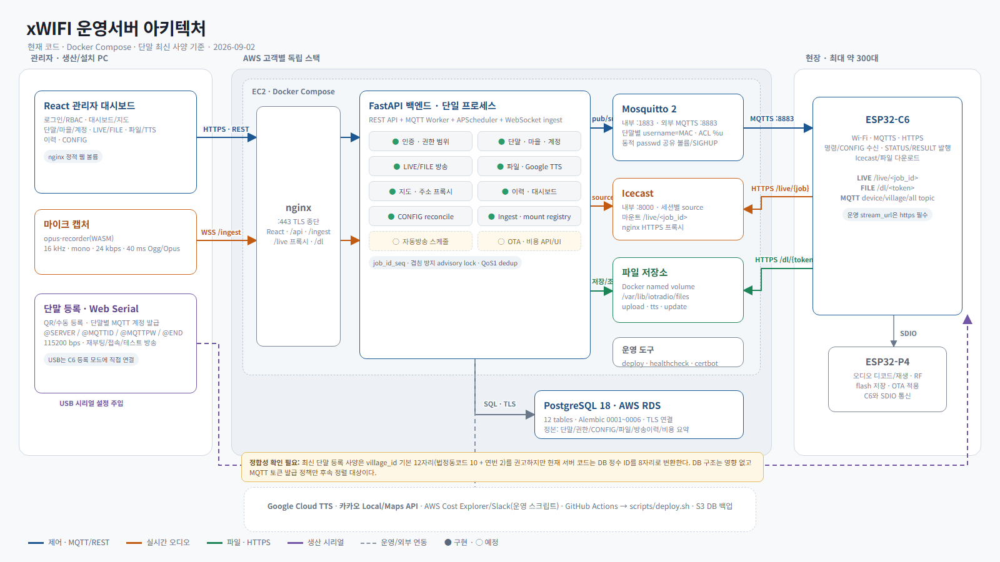

# xWIFI 운영서버 아키텍처

> 기준일: 2026-09-02
>
> 기준: 현재 `main` 코드, Docker Compose 구성, Alembic 0001~0006, 최신 ESP32 통신 문서

- 편집 가능한 원본: [`../diagrams/xwifi-architecture-260902.html`](../diagrams/xwifi-architecture-260902.html)
- PNG: [`../xWIFI_아키텍처_다이어그램_260902.png`](../xWIFI_아키텍처_다이어그램_260902.png)

## 1. 배치 구조

고객사별로 독립된 AWS 스택을 둔다. EC2 한 대에서 Docker Compose로 nginx, FastAPI, Mosquitto, Icecast를 실행하고, 운영 DB는 PostgreSQL 18 기반 AWS RDS를 기본으로 한다. 프론트엔드는 React/Vite 빌드 결과를 nginx가 제공한다.

| 영역 | 현재 구성 | 역할 |
|---|---|---|
| 관리자 | React 대시보드, 마이크 캡처, Web Serial 등록 | 운영·방송·단말 등록 |
| 진입점 | nginx :443 | TLS 종료, REST/WSS, `/live`, `/dl` 프록시 |
| 애플리케이션 | FastAPI 단일 프로세스 | REST API, MQTT worker, 스케줄러, ingest |
| 제어 채널 | Mosquitto 2 | 내부 :1883, 외부 MQTTS :8883, 단말별 계정·ACL |
| 실시간 오디오 | Icecast | 세션별 source와 `/live/<job_id>` 스트림 |
| 파일 | Docker named volume | 업로드·TTS·OTA 파일 및 `/dl/<token>` 원본 |
| 영속 DB | PostgreSQL 18 / AWS RDS | 조직·단말·파일·방송·CONFIG·비용 집계 |
| 외부 연동 | Google Cloud TTS, Kakao Local/Maps, AWS Cost Explorer/Slack | 합성·주소/지도·운영 비용 알림 |

개발 환경은 Compose 내부 PostgreSQL을 사용할 수 있지만, 운영 기본값은 RDS다. 운영 서버에는 직접 접속해 수정하지 않고 GitHub Actions와 `scripts/deploy.sh`를 통해 배포한다.

## 2. 주요 흐름

### 제어·상태

1. 관리자 요청은 HTTPS REST로 FastAPI에 들어온다.
2. 서버는 권한과 대상 범위를 확인하고 전역 `job_id_seq`에서 `job_id`를 발급한다.
3. 명령은 MQTT로 단말에 전달되고, 단말의 STATUS/RESULT/LIVE_STATS는 MQTT worker가 DB에 기록한다.
4. CONFIG는 현재 설정 버전을 기준으로 주기적으로 재조정하며, 상태 변경 이벤트는 즉시 처리한다.

### 실시간 방송

브라우저의 Ogg/Opus 오디오는 WSS `/ingest`로 들어오고, 백엔드가 세션별 Icecast source에 전달한다. 단말은 MQTT `LIVE_START`로 받은 HTTPS URL에서 오디오를 가져간다. 서버 내부 mount는 `/live/<job_id>`이며 nginx를 통해 외부 HTTPS로 제공한다.

### 파일·TTS 방송

파일 업로드 또는 Google Cloud TTS 결과를 저장소와 `files`에 등록한다. 방송 시작 시 짧은 수명의 다운로드 토큰을 만들고 MQTT `FILE_START`를 발행한다. 단말은 `/dl/<token>`으로 파일을 내려받아 SHA-256을 검증한 뒤 RESULT를 발행한다.

### 단말 등록

설치 PC가 USB-C로 C6의 등록 모드에 접속한다. 서버가 발급한 단말별 MQTT 계정과 설정을 Web Serial로 주입한다. 운영 MQTT는 `username = MAC`, 단말별 password, 동적 ACL로 다른 단말의 토픽 접근을 차단한다.

## 3. 구현 상태

현재 인증/RBAC, 마을·구역·계정, 단말 등록·관리, 대시보드, CONFIG, 파일 방송, 실시간 방송, TTS, 방송 이력이 구현되어 있다. 자동방송 스케줄과 OTA의 API/UI, 비용 조회·집계 애플리케이션은 아직 구현 전이다. 다만 이를 위한 `schedules`, `daily_cost_summary`, 방송 이벤트 테이블은 이미 DB에 존재한다.

## 4. 확인이 필요한 사양 차이

최신 단말 등록 문서는 `village_id`를 법정동코드 10자리와 연번 2자리로 구성한 **12자리**를 권장한다. 현재 서버 코드는 DB 정수 ID를 **8자리** 문자열로 변환한다. DB 물리 구조에는 영향이 없지만 MQTT topic, URL, 등록 응답에 영향을 주므로 ESP32 측과 전환 시점을 합의한 뒤 코드와 문서를 함께 바꿔야 한다.
